# Arquitectura de FitFlow

Este documento describe la arquitectura técnica del sistema FitFlow, una aplicación para gestión de gimnasios.

---

## Visión General

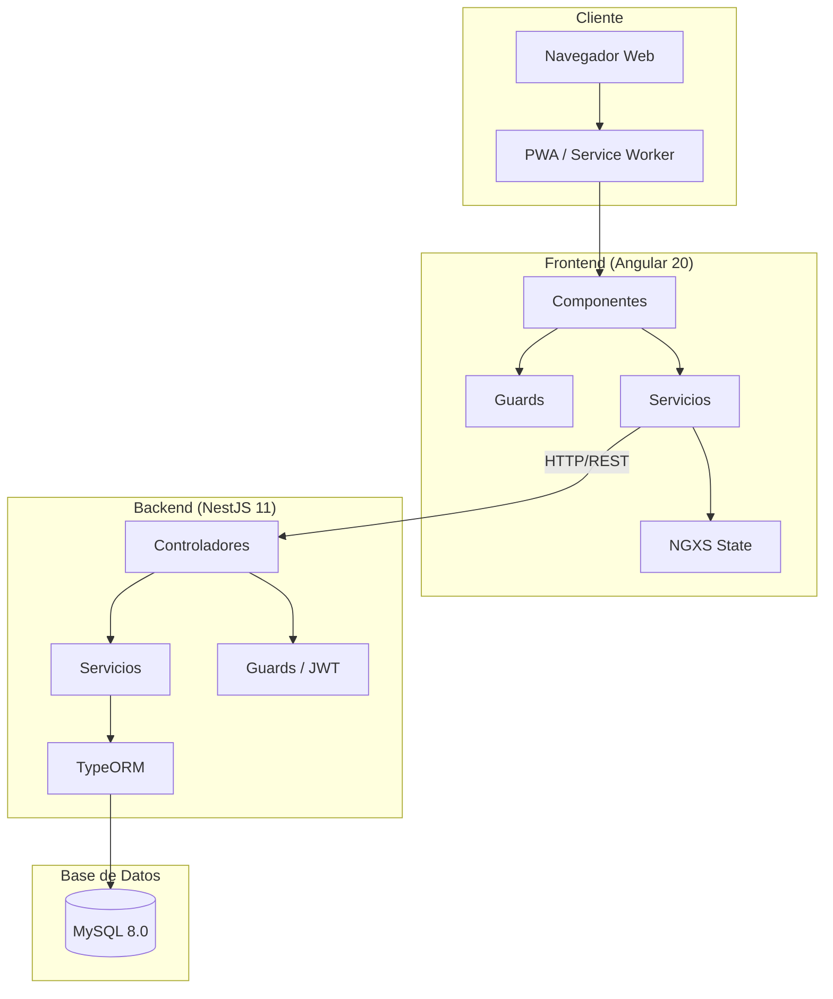

---

## Stack Tecnológico

| Capa                 | Tecnología | Versión |
| -------------------- | ---------- | ------- |
| **Frontend**         | Angular    | 20.x    |
| **State Management** | NGXS       | 18.x    |
| **Backend**          | NestJS     | 11.x    |
| **ORM**              | TypeORM    | 0.3.x   |
| **Base de Datos**    | MySQL      | 8.0     |
| **Autenticación**    | JWT        | -       |
| **Contenedores**     | Docker     | -       |

---

## Arquitectura del Frontend

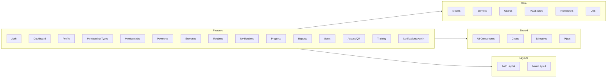

### Estructura de Carpetas Frontend

```
frontend/src/app/
├── core/
│   ├── guards/          # AuthGuard, GuestGuard
│   ├── interceptors/    # AuthInterceptor, ErrorInterceptor
│   ├── models/          # Interfaces y tipos (user, auth, routine, workout, etc.)
│   ├── services/        # ApiService, AuthService, StatsService, OfflineService, etc.
│   ├── store/           # NGXS States (auth, user, notifications, personal-records)
│   └── utils/           # Utilidades compartidas
├── features/
│   ├── access/          # Control de acceso QR
│   ├── auth/            # Login, Register, Password Reset
│   ├── dashboard/       # Home con métricas y actividad
│   ├── exercises/       # CRUD Ejercicios
│   ├── membership-types/# CRUD Tipos de Membresía
│   ├── memberships/     # CRUD Membresías de usuarios
│   │   ├── components/   # MembershipDialogComponent (crear membresía via dialog)
│   │   └── pages/        # list, form (edit only)
│   ├── my-routines/     # Vista semanal + Workout (Usuario)
│   ├── notifications-admin/ # Panel de notificaciones personalizadas
│   ├── payments/        # CRUD Pagos
│   ├── profile/         # Ver/Editar Perfil
│   ├── progress/        # Mi Progreso (gráficos de evolución)
│   ├── reports/         # Centro de Reportes (exportables)
│   ├── routines/        # CRUD Rutinas (Admin/Trainer)
│   ├── training/        # Gestión de entrenamiento
│   └── users/           # Gestión de usuarios
│       ├── components/   # UserDialogComponent (crear usuario via dialog)
│       └── pages/        # list, detail, edit
├── layouts/
│   ├── auth-layout/     # Layout para auth (sin nav)
│   └── main-layout/     # Layout principal (con nav y sidebar)
└── shared/
    ├── charts/          # Gráficos reutilizables (Chart.js)
    ├── components/      # UI Components (alert, avatar, badge, button, card, etc.)
    ├── directives/      # Directivas personalizadas
    ├── pipes/           # Pipes personalizados
    └── utils/           # Utilidades compartidas
```

---

## Arquitectura PWA / Offline

La aplicación implementa una estrategia de doble caché para funcionalidad offline completa en el flujo de entrenamientos.

### Capas de Caché

```
┌─────────────────────────────────────────────┐
│  Angular Service Worker (NGSW)              │
│  - Caché HTTP automático por dataGroups     │
│  - Estrategia "freshness" con timeout 5s    │
│  - Endpoints: programs, workouts, stats...  │
└──────────────────┬──────────────────────────┘
                   │ fallback
┌──────────────────▼──────────────────────────┐
│  IndexedDB (Dexie v3)                       │
│  - cachedPrograms, cachedRoutines           │
│  - cachedWorkouts, cachedExerciseLogs       │
│  - syncQueue (operaciones pendientes)       │
│  - idMappings (temp ID → server ID)         │
└──────────────────┬──────────────────────────┘
                   │ reconexión
┌──────────────────▼──────────────────────────┐
│  SyncManager + SyncQueue                    │
│  - Procesa cola FIFO al reconectar          │
│  - Resuelve IDs temporales → IDs servidor   │
│  - Retry con backoff exponencial            │
└─────────────────────────────────────────────┘
```

### Servicios Offline (Wrapper Pattern)

Los servicios offline envuelven a los servicios API directos con lógica online-first + fallback:

| Servicio Offline         | Servicio API          | Función                                        |
| ------------------------ | --------------------- | ---------------------------------------------- |
| `OfflineProgramsService` | `UserProgramsService` | Cargar programa y rutinas del usuario          |
| `OfflineWorkoutsService` | `WorkoutsService`     | Iniciar, actualizar y completar entrenamientos |

### Flujo de Datos Offline

```
Online:  Component → OfflineService → APIService → Backend → Cache IndexedDB
Offline: Component → OfflineService → Cache IndexedDB → Enqueue SyncQueue
Sync:    SyncManager → SyncQueue → Resolve Temp IDs → Backend
```

---

## Arquitectura del Backend

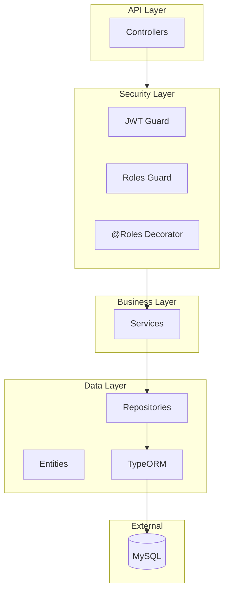

### Estructura de Carpetas Backend

```
backend/src/
├── common/
│   └── enums/           # Role, Difficulty, DayOfWeek, WorkoutStatus, etc.
├── config/              # Configuración (app, db, jwt)
├── database/
│   └── seeders/         # SeederService (datos iniciales)
├── modules/
│   ├── access/          # Control de acceso QR
│   ├── attendance/      # Registro de asistencia
│   ├── auth/            # Login, Register, JWT
│   │   ├── decorators/  # @Roles, @Public, @CurrentUser
│   │   ├── guards/      # JwtAuthGuard, JwtRefreshGuard, RolesGuard
│   │   ├── strategies/  # JwtStrategy, JwtRefreshStrategy
│   │   └── types/       # AuthenticatedUser
│   ├── dashboard/       # APIs de dashboard unificado
│   ├── exercises/       # CRUD Ejercicios
│   ├── membership-types/# CRUD Tipos Membresía
│   ├── memberships/     # CRUD Membresías
│   ├── muscle-groups/   # CRUD Grupos Musculares
│   ├── notifications/   # Sistema de notificaciones push
│   ├── payments/        # CRUD Pagos
│   ├── personal-records/# Detección y gestión de PRs
│   ├── qr/              # Generación y validación de códigos QR
│   ├── reports/         # Generación de reportes exportables
│   ├── routines/        # CRUD Rutinas y plantillas
│   ├── scheduler/       # Cron jobs y tareas programadas
│   ├── stats/           # Estadísticas y métricas
│   ├── user-routines/   # Asignación de rutinas a usuarios
│   ├── users/           # CRUD Usuarios
│   ├── websocket/       # Comunicación en tiempo real
│   └── workouts/        # Registro de entrenamientos
└── main.ts
```

---

## Modelo de Datos

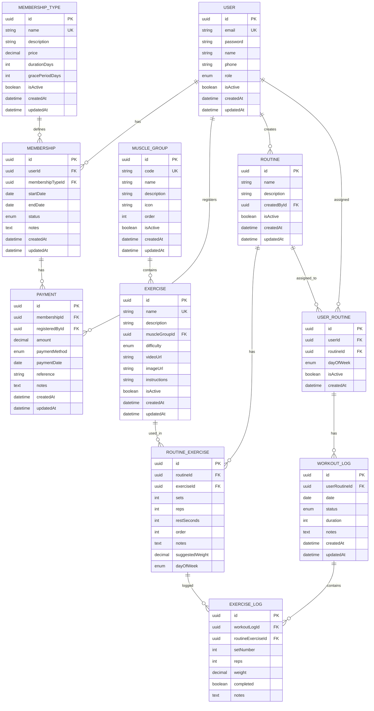

### Estados de Membresía

| Estado         | Descripción          |
| -------------- | -------------------- |
| `active`       | Membresía vigente    |
| `expired`      | Membresía vencida    |
| `cancelled`    | Membresía cancelada  |
| `grace_period` | En período de gracia |

### Métodos de Pago

| Método     | Descripción   |
| ---------- | ------------- |
| `cash`     | Efectivo      |
| `card`     | Tarjeta       |
| `transfer` | Transferencia |
| `other`    | Otro          |

---

## Flujo de Autenticación

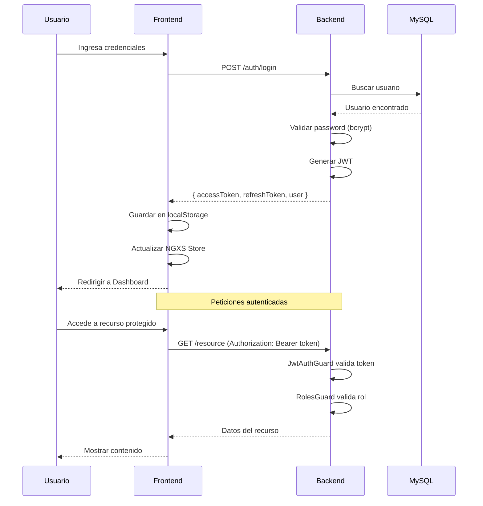

---

## Sistema de Roles

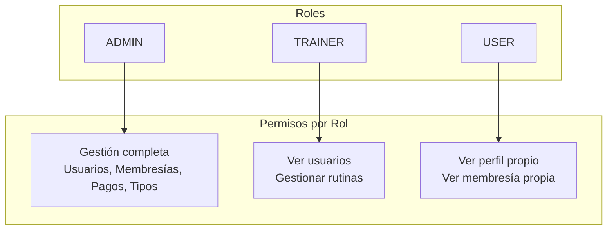

### Matriz de Permisos

| Recurso            | ADMIN | TRAINER | USER |
| ------------------ | ----- | ------- | ---- |
| Usuarios           | CRUD  | Read    | Self |
| Tipos Membresía    | CRUD  | Read    | Read |
| Membresías         | CRUD  | Read    | Self |
| Pagos              | CRUD  | -       | Self |
| Grupos Musculares  | CRUD  | Read    | Read |
| Ejercicios         | CRUD  | CRUD    | Read |
| Rutinas            | CRUD  | CRUD    | Read |
| Plantillas Rutinas | CRUD  | CRUD    | -    |
| Asignar Rutinas    | CRUD  | CRUD    | -    |
| Mis Rutinas        | -     | -       | Read |
| Entrenamientos     | All   | Read    | Self |
| Personal Records   | All   | Read    | Self |
| Acceso QR          | CRUD  | Read    | Self |
| Asistencia         | CRUD  | Read    | Self |
| Notificaciones     | CRUD  | Send    | Read |
| Reportes           | CRUD  | Read    | -    |
| Dashboard          | Full  | Limited | Self |
| Estadísticas       | Full  | Read    | Self |
| Perfil             | All   | Self    | Self |

---

## Configuración PWA

FitFlow está configurado como Progressive Web App (PWA), permitiendo:

- **Instalación** en dispositivos móviles y desktop
- **Modo offline** para funcionalidad completa de entrenamientos
- **Actualizaciones automáticas** del Service Worker
- **Sincronización automática** al recuperar conexión

---

## Sistema de Sincronización Offline

FitFlow implementa un sistema robusto de sincronización offline que permite a los usuarios completar entrenamientos sin conexión.

### Arquitectura Offline

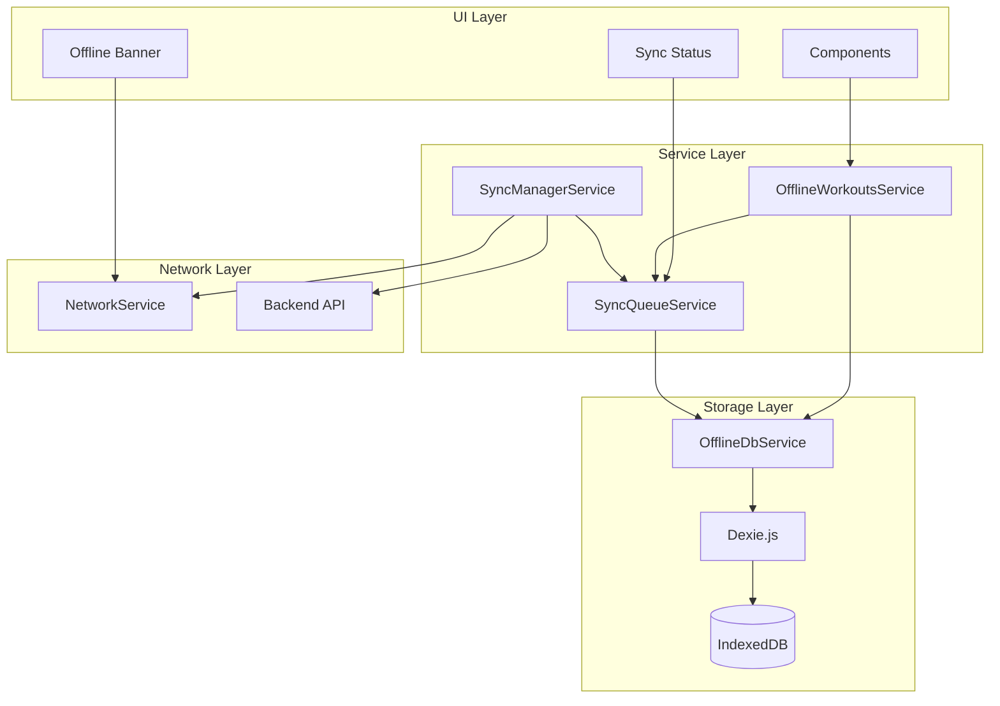

### Componentes del Sistema

| Componente               | Propósito                                       |
| ------------------------ | ----------------------------------------------- |
| `OfflineDbService`       | Wrapper de Dexie.js para IndexedDB con 6 tablas |
| `SyncQueueService`       | Cola FIFO de operaciones pendientes             |
| `SyncManagerService`     | Orquestador de sincronización automática        |
| `OfflineWorkoutsService` | Wrapper offline-first para WorkoutsService      |
| `OfflineBannerComponent` | Indicador visual de modo offline                |
| `SyncStatusComponent`    | Estado de sincronización con contador           |

### Esquema IndexedDB

```
FitFlowOfflineDb/
├── syncQueue          # Operaciones pendientes de sincronización
├── cachedRoutines     # Rutinas del día cacheadas
├── cachedUserRoutines # Rutinas de la semana
├── cachedWorkouts     # Entrenamientos (online y offline)
├── cachedExerciseLogs # Logs de ejercicios
└── idMappings         # Mapeo tempId -> serverId
```

### Flujo de Sincronización

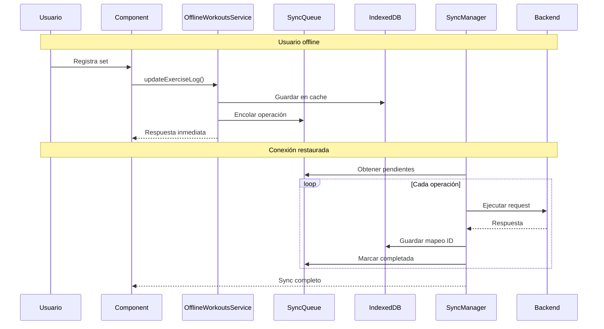

### Tipos de Operaciones Soportadas

| Operación             | Método | Endpoint                         |
| --------------------- | ------ | -------------------------------- |
| `CREATE_WORKOUT`      | POST   | `/workouts`                      |
| `START_WORKOUT`       | PATCH  | `/workouts/:id/start`            |
| `COMPLETE_WORKOUT`    | PATCH  | `/workouts/:id/complete`         |
| `LOG_EXERCISE`        | POST   | `/workouts/:id/exercises`        |
| `UPDATE_EXERCISE_LOG` | PATCH  | `/workouts/:id/exercises/:logId` |
| `DELETE_EXERCISE_LOG` | DELETE | `/workouts/:id/exercises/:logId` |

### Manejo de Conflictos

- **Estrategia:** Last-Write-Wins basado en timestamp
- **IDs temporales:** Formato `temp_{timestamp}_{random}` para operaciones offline
- **Mapeo de IDs:** Se mantiene relación tempId → serverId post-sync
- **Reintentos:** Máximo 3 reintentos con backoff exponencial

### Archivos de Configuración

| Archivo                | Propósito                                     |
| ---------------------- | --------------------------------------------- |
| `manifest.webmanifest` | Metadatos de la app (nombre, iconos, colores) |
| `ngsw-config.json`     | Configuración del Service Worker              |
| `src/assets/icons/`    | Iconos en diferentes tamaños                  |

### Service Worker Strategy

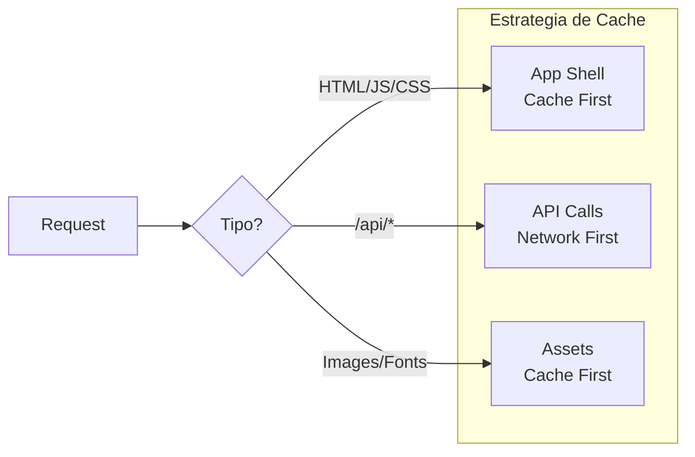

### Configuración del Manifest

```json
{
  "name": "FitFlow",
  "short_name": "FitFlow",
  "theme_color": "#667eea",
  "background_color": "#ffffff",
  "display": "standalone",
  "start_url": "/",
  "icons": [...]
}
```

---

## Sistema de Seeding

El backend incluye un sistema de seeding automático que se ejecuta al iniciar la aplicación.

### Funcionamiento

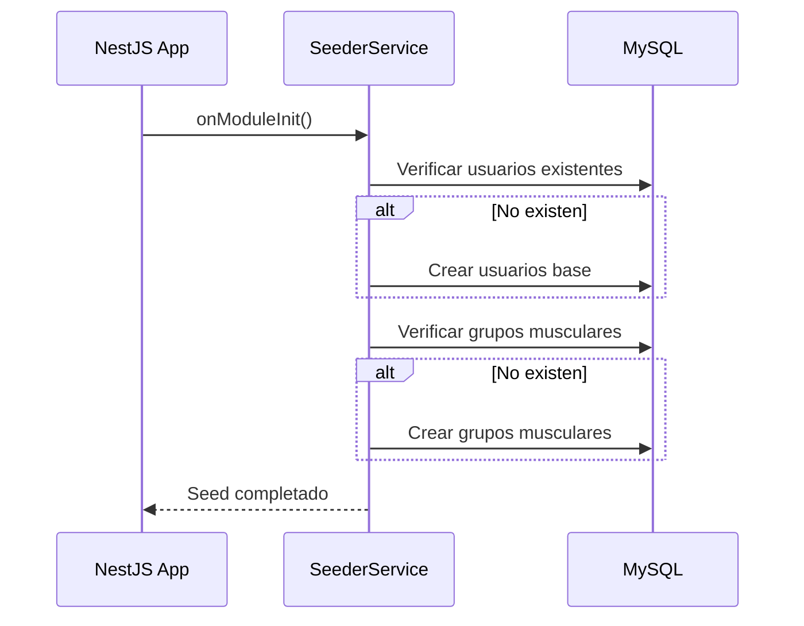

### Datos Iniciales

**Usuarios (5)**
| Email | Role | Estado |
|-------|------|--------|
| admin@fitflow.com | ADMIN | Activo |
| trainer@fitflow.com | TRAINER | Activo |
| user1@fitflow.com | USER | Activo |
| user2@fitflow.com | USER | Activo |
| inactive@fitflow.com | USER | Inactivo |

**Grupos Musculares (10)**
| Código | Nombre |
|--------|--------|
| chest | Pecho |
| back | Espalda |
| shoulders | Hombros |
| biceps | Bíceps |
| triceps | Tríceps |
| legs | Piernas |
| glutes | Glúteos |
| core | Core |
| cardio | Cardio |
| full_body | Cuerpo Completo |

### Características

- **Idempotente**: No duplica datos si ya existen
- **Automático**: Se ejecuta al iniciar el backend
- **Extensible**: Agregar nuevos seeders en `SeederService`

---

## Despliegue

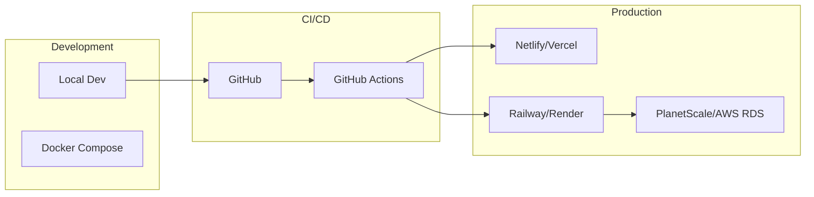

### Variables de Entorno

| Variable         | Descripción          | Ejemplo       |
| ---------------- | -------------------- | ------------- |
| `DB_HOST`        | Host de MySQL        | `localhost`   |
| `DB_PORT`        | Puerto de MySQL      | `3306`        |
| `DB_USERNAME`    | Usuario de DB        | `root`        |
| `DB_PASSWORD`    | Password de DB       | `****`        |
| `DB_DATABASE`    | Nombre de DB         | `fit_flow_db` |
| `JWT_SECRET`     | Secreto para JWT     | `****`        |
| `JWT_EXPIRES_IN` | Expiración del token | `1d`          |

---

## Seguridad

### Medidas Implementadas

1. **Autenticación JWT** - Tokens firmados con secreto, dual-token (access + refresh rotation)
2. **Hashing de Passwords** - bcrypt con 10 salt rounds
3. **Guards de Roles** - Control de acceso por rol (`RolesGuard` + `@Roles` decorator)
4. **Validación de DTOs** - class-validator con whitelist + forbidNonWhitelisted
5. **Interceptor HTTP** - Token automático en requests del frontend
6. **CORS configurado** - Solo orígenes permitidos via `ALLOWED_ORIGINS`
7. **Helmet** - Headers HTTP de seguridad activos en todos los endpoints
8. **Rate Limiting (global)** - `ThrottlerGuard`: 60 requests / 60s por IP
9. **Rate Limiting (login)** - `@Throttle` específico: 5 requests / 15 min por IP en `/auth/login` y `/auth/forgot-password`
10. **Account Lockout** - Bloqueo temporal de 15 min tras 5 intentos fallidos consecutivos (campos `failedLoginAttempts` y `lockedUntil` en entidad `User`)
11. **Audit Log** - Registro persistente en tabla `auth_audit_logs` de eventos: LOGIN_SUCCESS, LOGIN_FAILED, ACCOUNT_LOCKED, LOGOUT, PASSWORD_RESET_REQUEST, PASSWORD_RESET_SUCCESS

### Headers de Seguridad (via Helmet)

```
X-Content-Type-Options: nosniff
X-Frame-Options: DENY
X-XSS-Protection: 1; mode=block
Strict-Transport-Security: max-age=31536000
```

### Documentación de seguridad

Ver [`docs/technical/seguridad-login.md`](./technical/seguridad-login.md) para detalles de implementación completos.

---

## Referencias

- [Angular Documentation](https://angular.dev)
- [NestJS Documentation](https://docs.nestjs.com)
- [TypeORM Documentation](https://typeorm.io)
- [NGXS Documentation](https://www.ngxs.io)
- [Mermaid Documentation](https://mermaid.js.org)
