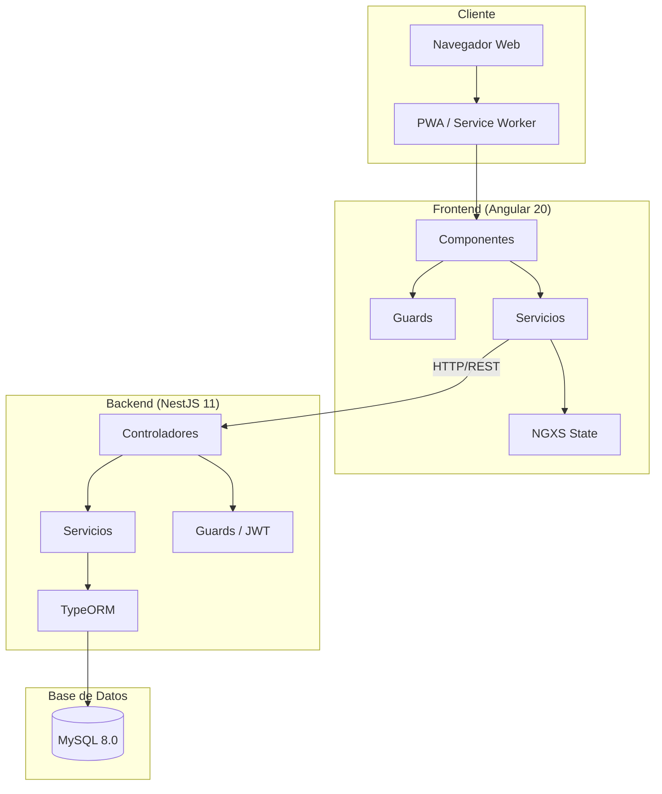
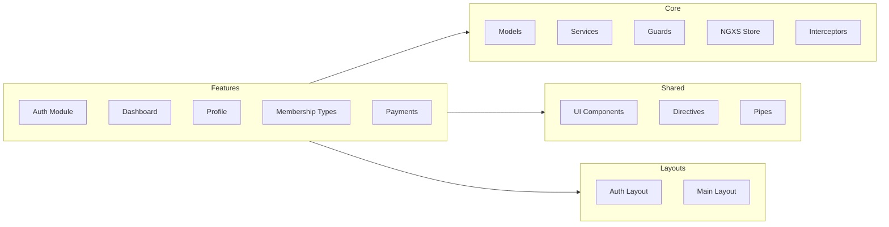
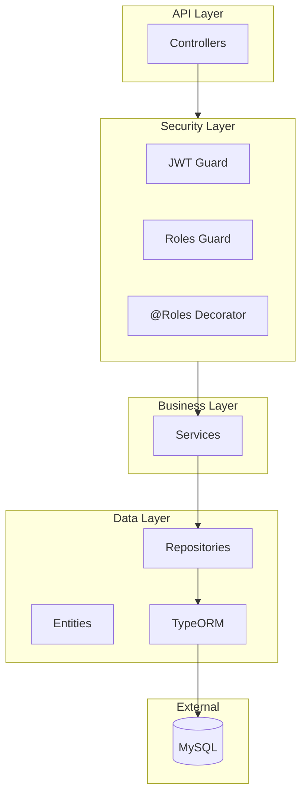
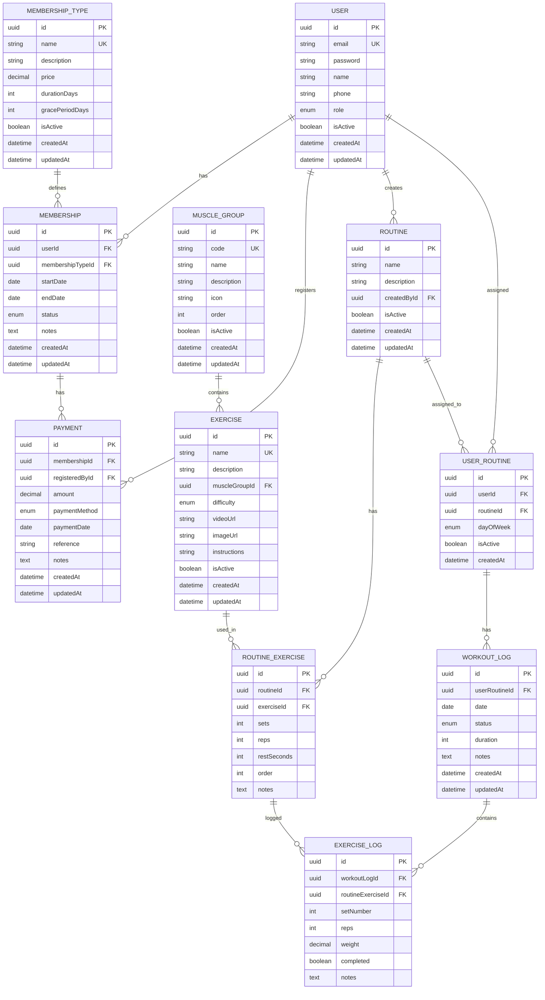
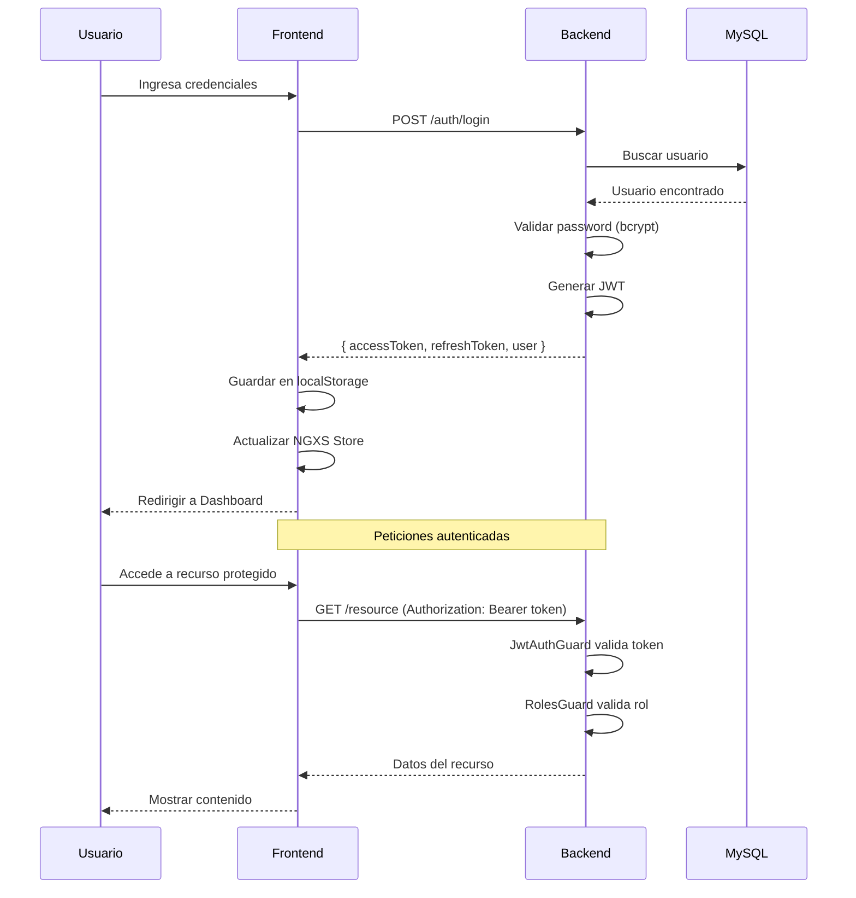
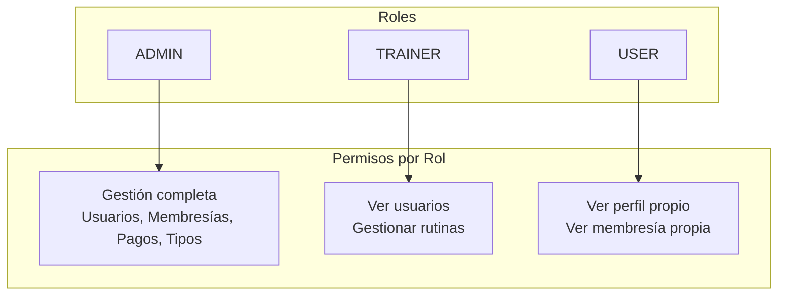
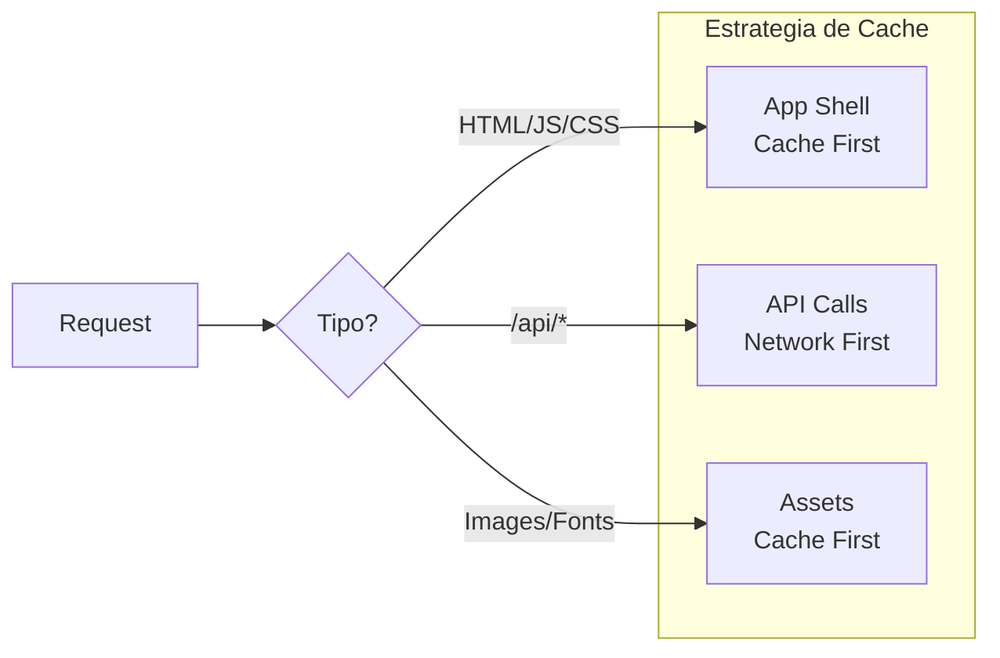
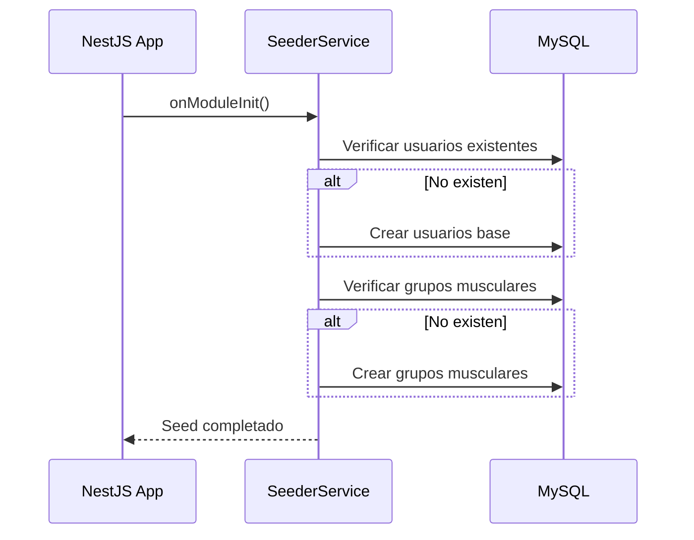
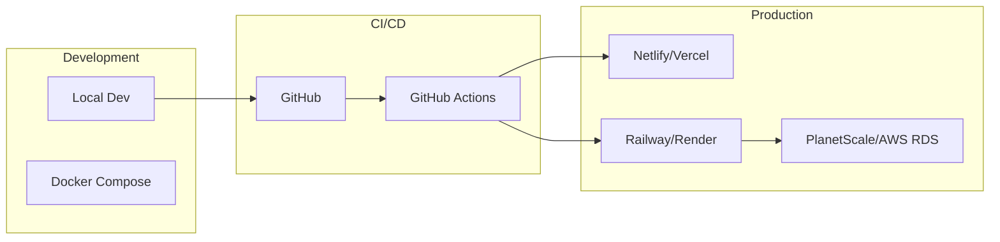

# Arquitectura de FitFlow

Este documento describe la arquitectura técnica del sistema FitFlow, una aplicación para gestión de gimnasios.

---

## Visión General



---

## Stack Tecnológico

| Capa                 | Tecnología | Versión |
| -------------------- | ---------- | ------- |
| **Frontend**         | Angular    | 20.x    |
| **State Management** | NGXS       | 18.x    |
| **Backend**          | NestJS     | 11.x    |
| **ORM**              | TypeORM    | 0.3.x   |
| **Base de Datos**    | MySQL      | 8.0     |
| **Autenticación**    | JWT        | -       |
| **Contenedores**     | Docker     | -       |

---

## Arquitectura del Frontend



### Estructura de Carpetas Frontend

```
frontend/src/app/
├── core/
│   ├── guards/          # AuthGuard, RoleGuard
│   ├── interceptors/    # AuthInterceptor
│   ├── models/          # Interfaces y tipos
│   ├── services/        # ApiService, AuthService, etc.
│   └── store/           # NGXS States y Actions
├── features/
│   ├── auth/            # Login, Register, Password Reset
│   ├── dashboard/       # Home
│   ├── membership-types/# CRUD Tipos de Membresía
│   ├── payments/        # CRUD Pagos
│   └── profile/         # Ver/Editar Perfil
├── layouts/
│   ├── auth-layout/     # Layout para auth (sin nav)
│   └── main-layout/     # Layout principal (con nav)
└── shared/
    └── components/      # Card, Button, Alert, etc.
```

---

## Arquitectura del Backend



### Estructura de Carpetas Backend

```
backend/src/
├── common/
│   └── enums/           # Role, Difficulty, DayOfWeek, WorkoutStatus
├── config/              # Configuración (app, db, jwt)
├── database/
│   └── seeders/         # SeederService (datos iniciales)
├── modules/
│   ├── auth/            # Login, Register, JWT
│   │   ├── decorators/  # @Roles, @Public
│   │   ├── guards/      # JwtAuthGuard, RolesGuard
│   │   ├── strategies/  # JwtStrategy
│   │   └── types/       # AuthenticatedUser
│   ├── users/           # CRUD Usuarios
│   ├── membership-types/# CRUD Tipos Membresía
│   ├── memberships/     # CRUD Membresías
│   ├── payments/        # CRUD Pagos
│   ├── muscle-groups/   # CRUD Grupos Musculares
│   ├── exercises/       # CRUD Ejercicios
│   ├── routines/        # CRUD Rutinas
│   ├── user-routines/   # Asignación de rutinas a usuarios
│   └── workouts/        # Registro de entrenamientos
└── main.ts
```

---

## Modelo de Datos



### Estados de Membresía

| Estado         | Descripción          |
| -------------- | -------------------- |
| `active`       | Membresía vigente    |
| `expired`      | Membresía vencida    |
| `cancelled`    | Membresía cancelada  |
| `grace_period` | En período de gracia |

### Métodos de Pago

| Método     | Descripción   |
| ---------- | ------------- |
| `cash`     | Efectivo      |
| `card`     | Tarjeta       |
| `transfer` | Transferencia |
| `other`    | Otro          |

---

## Flujo de Autenticación



---

## Sistema de Roles



### Matriz de Permisos

| Recurso           | ADMIN | TRAINER | USER |
| ----------------- | ----- | ------- | ---- |
| Usuarios          | CRUD  | Read    | Self |
| Tipos Membresía   | CRUD  | Read    | Read |
| Membresías        | CRUD  | Read    | Self |
| Pagos             | CRUD  | -       | Self |
| Grupos Musculares | CRUD  | Read    | Read |
| Ejercicios        | CRUD  | Read    | Read |
| Rutinas           | CRUD  | CRUD    | Read |
| Asignar Rutinas   | CRUD  | CRUD    | -    |
| Mis Rutinas       | -     | -       | Read |
| Entrenamientos    | All   | Read    | Self |
| Perfil            | All   | Self    | Self |

---

## Configuración PWA

FitFlow está configurado como Progressive Web App (PWA), permitiendo:

- **Instalación** en dispositivos móviles y desktop
- **Modo offline** para funcionalidad básica
- **Actualizaciones automáticas** del Service Worker

### Archivos de Configuración

| Archivo                | Propósito                                     |
| ---------------------- | --------------------------------------------- |
| `manifest.webmanifest` | Metadatos de la app (nombre, iconos, colores) |
| `ngsw-config.json`     | Configuración del Service Worker              |
| `src/assets/icons/`    | Iconos en diferentes tamaños                  |

### Service Worker Strategy



### Configuración del Manifest

```json
{
  "name": "FitFlow",
  "short_name": "FitFlow",
  "theme_color": "#667eea",
  "background_color": "#ffffff",
  "display": "standalone",
  "start_url": "/",
  "icons": [...]
}
```

---

## Sistema de Seeding

El backend incluye un sistema de seeding automático que se ejecuta al iniciar la aplicación.

### Funcionamiento



### Datos Iniciales

**Usuarios (5)**
| Email | Role | Estado |
|-------|------|--------|
| admin@fitflow.com | ADMIN | Activo |
| trainer@fitflow.com | TRAINER | Activo |
| user1@fitflow.com | USER | Activo |
| user2@fitflow.com | USER | Activo |
| inactive@fitflow.com | USER | Inactivo |

**Grupos Musculares (10)**
| Código | Nombre |
|--------|--------|
| chest | Pecho |
| back | Espalda |
| shoulders | Hombros |
| biceps | Bíceps |
| triceps | Tríceps |
| legs | Piernas |
| glutes | Glúteos |
| core | Core |
| cardio | Cardio |
| full_body | Cuerpo Completo |

### Características

- **Idempotente**: No duplica datos si ya existen
- **Automático**: Se ejecuta al iniciar el backend
- **Extensible**: Agregar nuevos seeders en `SeederService`

---

## Despliegue



### Variables de Entorno

| Variable         | Descripción          | Ejemplo       |
| ---------------- | -------------------- | ------------- |
| `DB_HOST`        | Host de MySQL        | `localhost`   |
| `DB_PORT`        | Puerto de MySQL      | `3306`        |
| `DB_USERNAME`    | Usuario de DB        | `root`        |
| `DB_PASSWORD`    | Password de DB       | `****`        |
| `DB_DATABASE`    | Nombre de DB         | `fit_flow_db` |
| `JWT_SECRET`     | Secreto para JWT     | `****`        |
| `JWT_EXPIRES_IN` | Expiración del token | `1d`          |

---

## Seguridad

### Medidas Implementadas

1. **Autenticación JWT** - Tokens firmados con secreto
2. **Hashing de Passwords** - bcrypt con salt rounds
3. **Guards de Roles** - Control de acceso por rol
4. **Validación de DTOs** - class-validator en backend
5. **Interceptor HTTP** - Token automático en requests
6. **CORS configurado** - Solo orígenes permitidos

### Headers de Seguridad Recomendados

```
X-Content-Type-Options: nosniff
X-Frame-Options: DENY
X-XSS-Protection: 1; mode=block
Strict-Transport-Security: max-age=31536000
```

---

## Referencias

- [Angular Documentation](https://angular.dev)
- [NestJS Documentation](https://docs.nestjs.com)
- [TypeORM Documentation](https://typeorm.io)
- [NGXS Documentation](https://www.ngxs.io)
- [Mermaid Documentation](https://mermaid.js.org)
