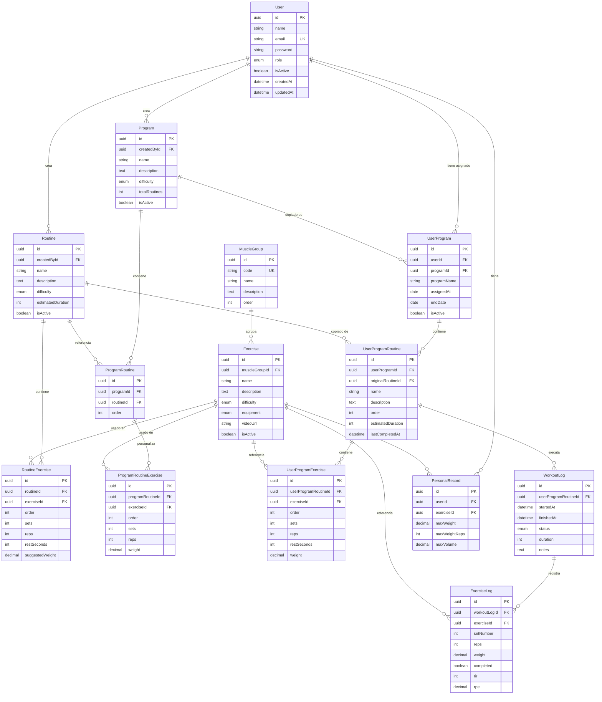
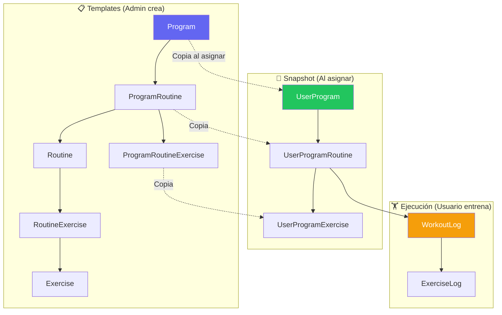

# FitFlow - Esquema de Base de Datos (V2)

Este documento muestra el diagrama de entidades y relaciones de la base de datos.

> **Para visualizar**: Instala el plugin "Markdown Preview Mermaid Support" en VS Code o usa https://mermaid.live

## Diagrama ER - Módulo de Rutinas y Programas



## Diagrama de Flujo - Entrenamiento



## Entidades Principales

| Entidad                    | Tipo      | Descripción                                 |
| -------------------------- | --------- | ------------------------------------------- |
| **Routine**                | Template  | Rutina base con ejercicios                  |
| **RoutineExercise**        | Template  | Ejercicios de la rutina                     |
| **Program**                | Template  | Programa semanal (agrupa rutinas)           |
| **ProgramRoutine**         | Template  | Rutina dentro del programa                  |
| **ProgramRoutineExercise** | Template  | Ejercicios personalizados para el programa  |
| **UserProgram**            | Snapshot  | Programa asignado a usuario                 |
| **UserProgramRoutine**     | Snapshot  | Rutina copiada para el usuario              |
| **UserProgramExercise**    | Snapshot  | Ejercicios copiados (editables por usuario) |
| **WorkoutLog**             | Ejecución | Registro de sesión de entrenamiento         |
| **ExerciseLog**            | Ejecución | Registro de cada serie realizada            |

## Flujo de Datos

### 1. Admin/Entrenador crea Templates

```
Routine + RoutineExercise → Rutina base
Program + ProgramRoutine + ProgramRoutineExercise → Programa con personalizaciones
```

### 2. Asignar programa a usuario (SNAPSHOT)

```
Program → UserProgram (copia nombre, referencia original)
ProgramRoutine → UserProgramRoutine (copia datos, guarda lastCompletedAt)
ProgramRoutineExercise → UserProgramExercise (copia ejercicios editables)
```

**Importante**: El snapshot es INMUTABLE respecto al template original. Si el admin modifica el programa, NO afecta a usuarios ya asignados.

### 3. Usuario ejecuta rutina

```
UserProgramRoutine → WorkoutLog (startedAt, timer inicia)
WorkoutLog → ExerciseLog (cada serie completada)
WorkoutLog.finishedAt → Timer finaliza
UserProgramRoutine.lastCompletedAt → Se actualiza
```

### 4. Próxima ejecución

```
Buscar último WorkoutLog de esta UserProgramRoutine
Cargar ExerciseLogs → Pre-llenar formulario con últimos valores
```

## Entidades Eliminadas

| Entidad                   | Razón                                         |
| ------------------------- | --------------------------------------------- |
| ~~UserRoutine~~           | Solo se asignan programas, no rutinas sueltas |
| ~~dayOfWeek / dayNumber~~ | Sin secuencialidad obligatoria                |
| ~~Routine.type (WEEKLY)~~ | Program es entidad separada                   |
