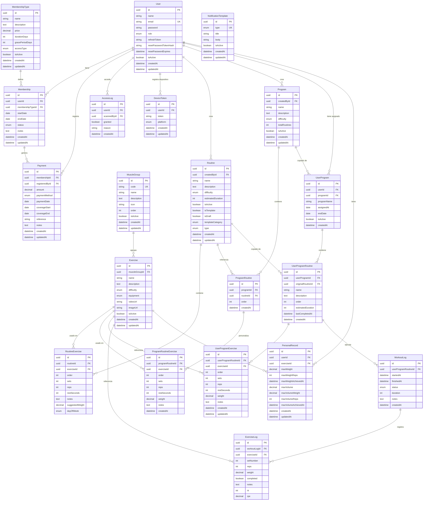
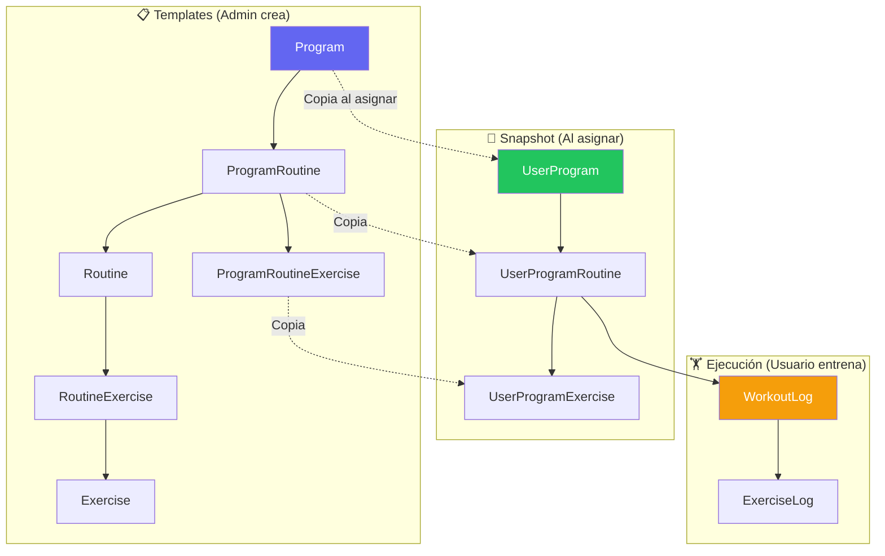

# FitFlow - Esquema de Base de Datos (V3)

Este documento muestra el diagrama de entidades y relaciones de la base de datos.

> **Para visualizar**: Instala el plugin "Markdown Preview Mermaid Support" en VS Code o usa https://mermaid.live
>
> **Última actualización**: Febrero 2026

## Diagrama ER - Completo



## Diagrama de Flujo - Entrenamiento



## Entidades por Módulo

### Módulo de Usuarios y Acceso

| Entidad       | Tipo | Descripción                              |
| ------------- | ---- | ---------------------------------------- |
| **User**      | Core | Usuario del sistema (admin/trainer/user) |
| **AccessLog** | Log  | Registro de acceso al gimnasio (QR)      |

### Módulo de Membresías y Pagos

| Entidad            | Tipo   | Descripción                    |
| ------------------ | ------ | ------------------------------ |
| **MembershipType** | Config | Tipos de membresía disponibles |
| **Membership**     | Core   | Membresía activa de un usuario |
| **Payment**        | Log    | Registro de pagos realizados   |

### Módulo de Notificaciones

| Entidad                  | Tipo   | Descripción                      |
| ------------------------ | ------ | -------------------------------- |
| **NotificationTemplate** | Config | Plantillas de notificación       |
| **DeviceToken**          | Core   | Tokens de dispositivos para push |

### Módulo de Rutinas y Programas

| Entidad                    | Tipo     | Descripción                                 |
| -------------------------- | -------- | ------------------------------------------- |
| **MuscleGroup**            | Config   | Grupos musculares                           |
| **Exercise**               | Config   | Ejercicio individual                        |
| **Routine**                | Template | Rutina base con ejercicios                  |
| **RoutineExercise**        | Template | Ejercicios de la rutina                     |
| **Program**                | Template | Programa (agrupa rutinas)                   |
| **ProgramRoutine**         | Template | Rutina dentro del programa                  |
| **ProgramRoutineExercise** | Template | Ejercicios personalizados para el programa  |
| **UserProgram**            | Snapshot | Programa asignado a usuario                 |
| **UserProgramRoutine**     | Snapshot | Rutina copiada para el usuario              |
| **UserProgramExercise**    | Snapshot | Ejercicios copiados (editables por usuario) |

### Módulo de Entrenamientos

| Entidad            | Tipo      | Descripción                           |
| ------------------ | --------- | ------------------------------------- |
| **WorkoutLog**     | Ejecución | Registro de sesión de entrenamiento   |
| **ExerciseLog**    | Ejecución | Registro de cada serie realizada      |
| **PersonalRecord** | Récord    | Mejor marca por ejercicio por usuario |

## Flujo de Datos

### 1. Admin/Entrenador crea Templates

```
Routine + RoutineExercise → Rutina base
Program + ProgramRoutine + ProgramRoutineExercise → Programa con personalizaciones
```

### 2. Asignar programa a usuario (SNAPSHOT)

```
Program → UserProgram (copia nombre, referencia original)
ProgramRoutine → UserProgramRoutine (copia datos, guarda lastCompletedAt)
ProgramRoutineExercise → UserProgramExercise (copia ejercicios editables)
```

**Importante**: El snapshot es INMUTABLE respecto al template original. Si el admin modifica el programa, NO afecta a usuarios ya asignados.

### 3. Usuario ejecuta rutina

```
UserProgramRoutine → WorkoutLog (startedAt, timer inicia)
WorkoutLog → ExerciseLog (cada serie completada con reps, peso, RIR, RPE)
WorkoutLog.finishedAt → Timer finaliza
UserProgramRoutine.lastCompletedAt → Se actualiza
PersonalRecord → Se verifica y actualiza si hay nuevo PR
```

### 4. Próxima ejecución

```
Buscar último WorkoutLog de esta UserProgramRoutine
Cargar ExerciseLogs → Pre-llenar formulario con últimos valores
```

## Enums Utilizados

| Enum                 | Valores                                                                          | Usado en                   |
| -------------------- | -------------------------------------------------------------------------------- | -------------------------- |
| **Role**             | user, admin, trainer                                                             | User                       |
| **Difficulty**       | beginner, intermediate, advanced                                                 | Exercise, Routine, Program |
| **Equipment**        | none, barbell, dumbbell, etc.                                                    | Exercise                   |
| **RoutineType**      | daily, weekly                                                                    | Routine                    |
| **TemplateCategory** | strength, hypertrophy, endurance, cardio, etc.                                   | Routine                    |
| **DayOfWeek**        | monday-sunday                                                                    | RoutineExercise            |
| **WorkoutStatus**    | pending, in_progress, completed, skipped                                         | WorkoutLog                 |
| **MembershipStatus** | active, expired, cancelled, grace_period                                         | Membership                 |
| **PaymentMethod**    | cash, card, transfer, other                                                      | Payment                    |
| **AccessType**       | all_access, etc.                                                                 | MembershipType             |
| **DevicePlatform**   | web, android, ios                                                                | DeviceToken                |
| **NotificationType** | MEMBERSHIP_EXPIRING, MEMBERSHIP_EXPIRED, LOW_ATTENDANCE, PERSONAL_RECORD, CUSTOM | NotificationTemplate       |

## Entidades Eliminadas (Historial)

| Entidad                   | Razón                                         |
| ------------------------- | --------------------------------------------- |
| ~~UserRoutine~~           | Solo se asignan programas, no rutinas sueltas |
| ~~dayOfWeek / dayNumber~~ | Sin secuencialidad obligatoria en programas   |
