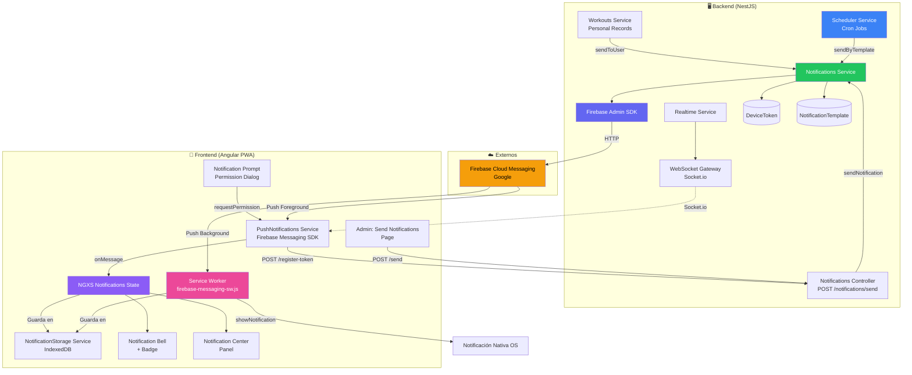
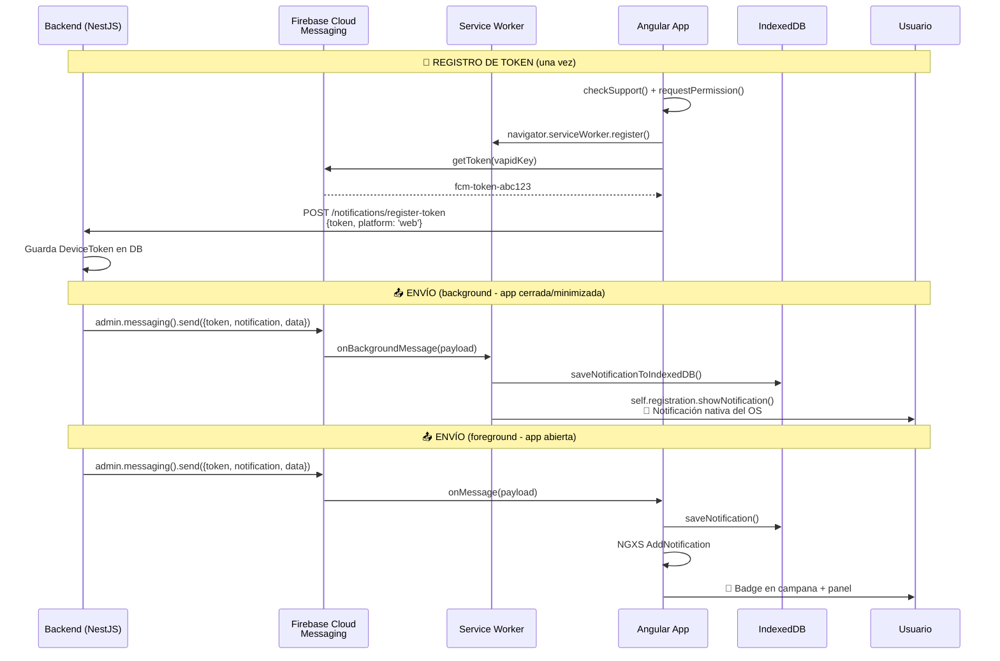
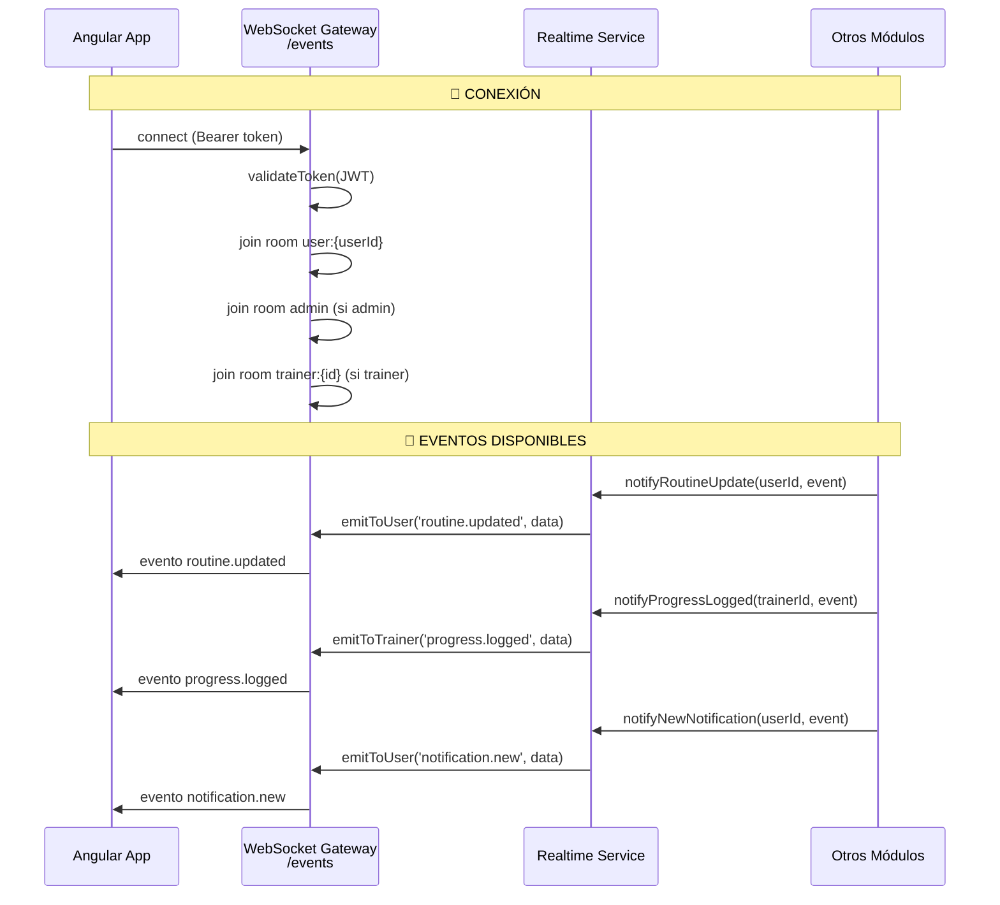
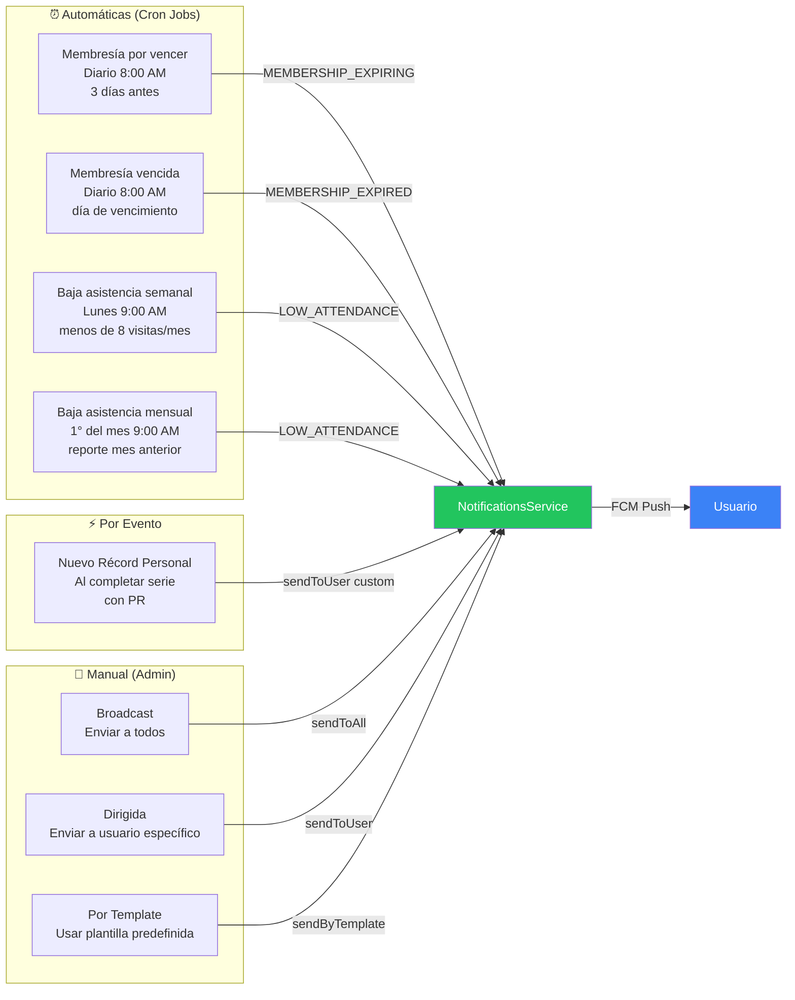
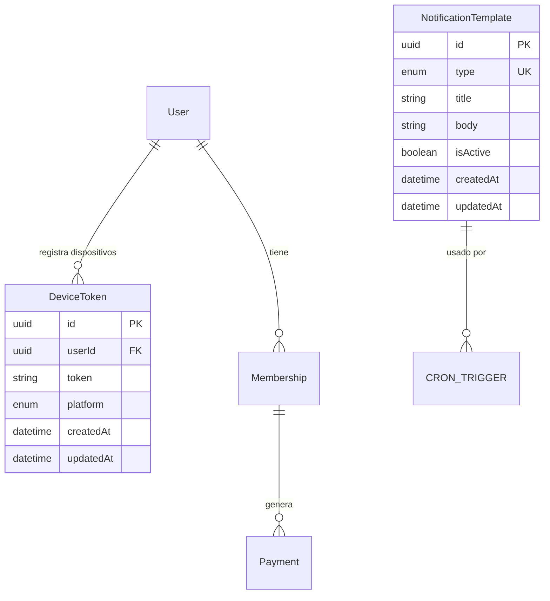
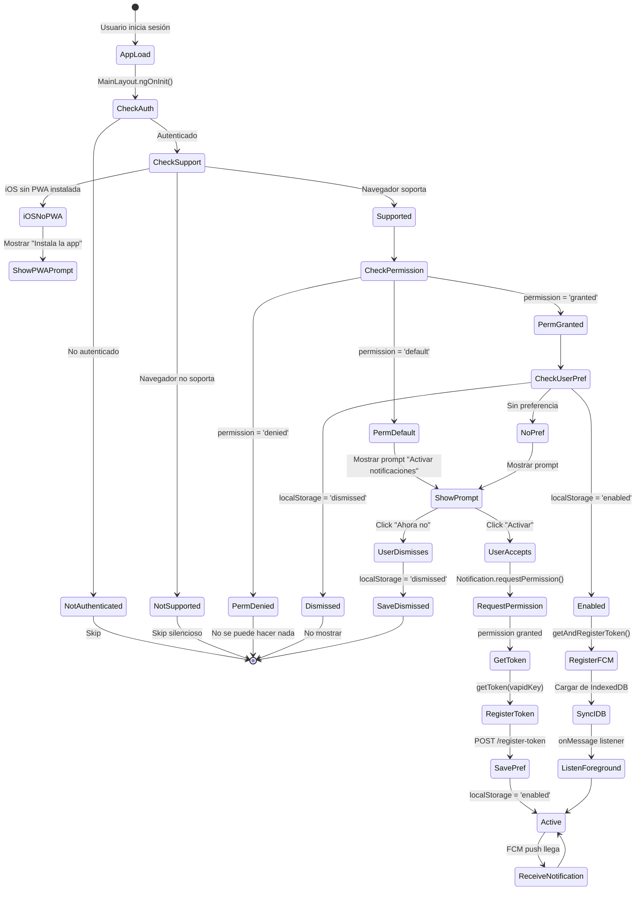
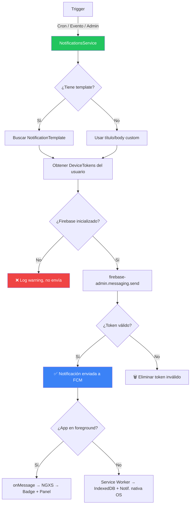

# FitFlow - Sistema de Notificaciones

Documento que describe el flujo completo de notificaciones implementado en la aplicación.

> **Para visualizar**: Instala el plugin "Markdown Preview Mermaid Support" en VS Code o usa https://mermaid.live
>
> **Última actualización**: Febrero 2026

---

## Arquitectura General



---

## Canales de Notificación

La app tiene **2 canales** de comunicación en tiempo real:

### 1. Firebase Cloud Messaging (FCM) — Push Notifications

Canal principal para notificaciones al usuario. Funciona en background y foreground.



### 2. WebSocket (Socket.io) — Eventos en Tiempo Real

Canal secundario para eventos de la app (NO push notifications).



> **Nota**: El evento `notification.new` por WebSocket fue **deshabilitado** en `sendToUser()` para evitar duplicados con FCM. El comentario en el código dice: _"Don't send WebSocket notification - FCM handles it. WebSocket was causing duplicate notifications."_

---

## Triggers (¿Qué dispara notificaciones?)



---

## Notification Templates

Templates predefinidas almacenadas en la tabla `notification_templates`:

| Tipo                  | Trigger              | Descripción                                |
| --------------------- | -------------------- | ------------------------------------------ |
| `MEMBERSHIP_EXPIRING` | Cron diario 8AM      | Membresía vence en 3 días                  |
| `MEMBERSHIP_EXPIRED`  | Cron diario 8AM      | Membresía venció hoy                       |
| `LOW_ATTENDANCE`      | Cron semanal/mensual | Menos de 8 visitas al mes                  |
| `PERSONAL_RECORD`     | Evento en workout    | Nuevo PR (no usa template, mensaje custom) |
| `CUSTOM`              | Manual por admin     | Mensaje personalizado                      |

---

## Modelo de Datos



---

## Frontend: Flujo de Permisos y Preferencias



---

## Frontend: Almacenamiento Local

```mermaid
flowchart TB
    subgraph Storage["💾 Persistencia de Notificaciones"]
        IDB[(IndexedDB<br/>fitflow-notifications)]
        LS[(localStorage<br/>Preferencias)]
        NGXS_S[NGXS State<br/>En memoria]
    end

    subgraph Writes["Escrituras"]
        SW_W[Service Worker<br/>Background msg] -->|put| IDB
        FG_W[Foreground msg] -->|saveNotification| IDB
        FG_W -->|AddNotification| NGXS_S
        PREF[User Preference] -->|setItem| LS
    end

    subgraph Reads["Lecturas"]
        IDB -->|getAllNotifications<br/>on visibility change| NGXS_S
        LS -->|getItem<br/>notification_preference_{userId}| INIT[Initialization Check]
        NGXS_S -->|selectSignal| BELL_R[Bell Badge]
        NGXS_S -->|selectSignal| CENTER_R[Notification List]
    end

    subgraph Keys["Claves localStorage"]
        K1["notification_preference_{userId}<br/>= 'enabled' | 'dismissed' | null"]
    end
```

---

## Componentes UI

| Componente                     | Ubicación           | Función                                       |
| ------------------------------ | ------------------- | --------------------------------------------- |
| `NotificationBellComponent`    | Header (MainLayout) | Icono campana con badge de no leídas          |
| `NotificationCenterComponent`  | Header (MainLayout) | Panel desplegable con lista de notificaciones |
| `NotificationPromptComponent`  | MainLayout          | Dialog para pedir permiso de notificaciones   |
| `SendNotificationsComponent`   | Admin page          | Enviar broadcast o dirigidas desde UI admin   |
| `NotificationHistoryComponent` | Admin page          | Historial local de notificaciones enviadas    |

---

## API Endpoints

| Método   | Endpoint                          | Rol   | Descripción                         |
| -------- | --------------------------------- | ----- | ----------------------------------- |
| `POST`   | `/notifications/register-token`   | User  | Registrar FCM token del dispositivo |
| `DELETE` | `/notifications/unregister-token` | User  | Eliminar FCM token                  |
| `POST`   | `/notifications/send`             | Admin | Enviar notificación (3 modos)       |
| `GET`    | `/notifications/templates`        | Admin | Listar templates                    |
| `POST`   | `/notifications/templates`        | Admin | Crear template                      |
| `POST`   | `/notifications/templates/:id`    | Admin | Actualizar template                 |
| `GET`    | `/notifications/debug/tokens`     | Admin | Ver todos los tokens registrados    |
| `DELETE` | `/notifications/debug/cleanup`    | Admin | Limpiar tokens duplicados           |

### Modos de envío (`POST /notifications/send`):

```
1. Broadcast:  { broadcast: true, title, body }
2. Dirigida:   { userId, title, body }
3. Template:   { userId, templateType }
```

---

## Configuración Firebase

### Backend (`firebase-admin`)

- **Credenciales**: `projectId`, `clientEmail`, `privateKey` via ConfigService
- **Inicialización**: `OnModuleInit` → `initializeFirebase()`
- Si no hay credenciales, las notificaciones push se deshabilitan con warning

### Frontend (`firebase/messaging`)

- **Config**: `environment.firebase` (apiKey, authDomain, projectId, etc.)
- **VAPID Key**: `environment.firebase.vapidKey`
- **Service Worker**: `public/firebase-messaging-sw.js` (registrado manualmente)

---

## WebSocket Events

| Evento             | Room Target           | Disparado por   | Descripción                                 |
| ------------------ | --------------------- | --------------- | ------------------------------------------- |
| `routine.updated`  | `user:{userId}`       | RealtimeService | Rutina fue actualizada                      |
| `progress.logged`  | `trainer:{trainerId}` | RealtimeService | Usuario registró progreso                   |
| `notification.new` | `user:{userId}`       | RealtimeService | Nueva notificación (deshabilitado para FCM) |

---

## Resumen de Flujo Completo


