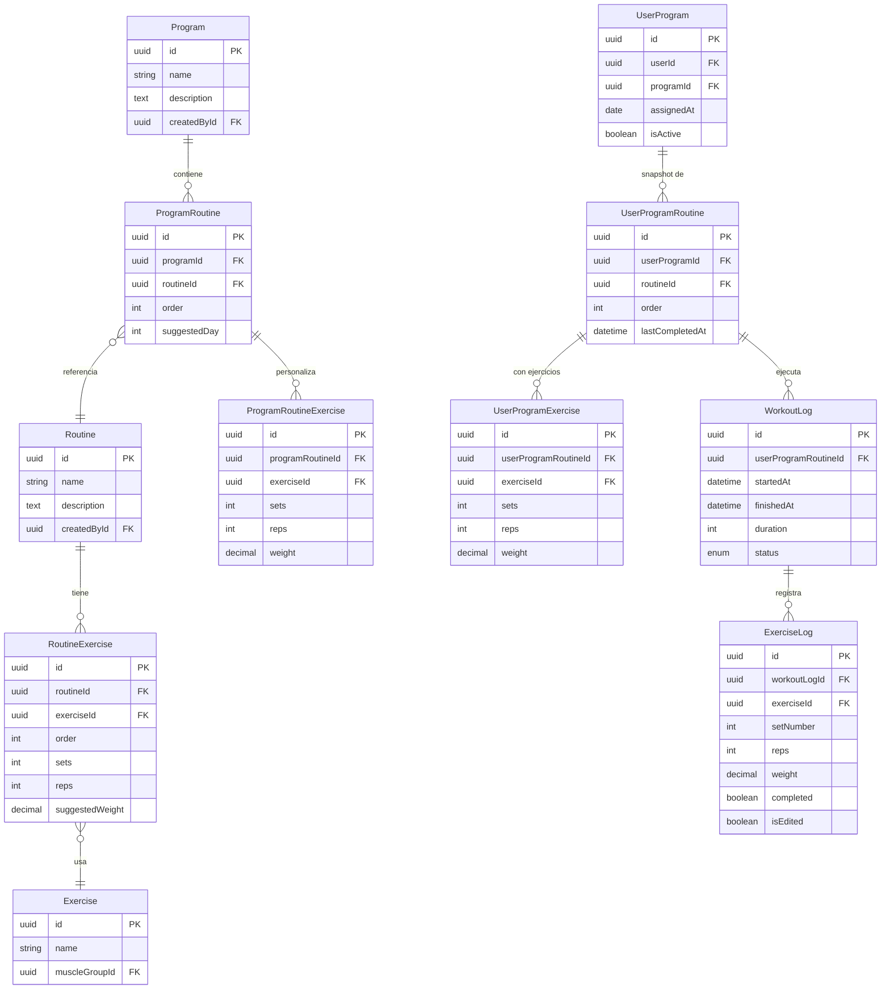

# Requisitos del Módulo de Rutinas - V2

## 📋 Requisitos Funcionales

### Rol: Administrador/Entrenador

| ID | Requisito | Descripción |
|----|-----------|-------------|
| A1 | Crear Rutinas | Crear rutinas individuales con ejercicios, series, repeticiones y pesos sugeridos |
| A2 | Crear Programa Semanal | Agrupar rutinas en un programa semanal (sin días fijos) |
| A3 | Personalizar al Asignar | Al agregar una rutina a un programa, poder editar pesos/reps/series para esa instancia |
| A4 | Asignar Programa | Asignar un programa semanal completo a un usuario |
| A5 | Inmutabilidad | Al editar un programa/rutina, NO afectar a usuarios que ya tienen asignado |

### Rol: Usuario (Cliente)

| ID | Requisito | Descripción |
|----|-----------|-------------|
| U1 | Ver Rutinas | En `/my-routines` ver todas las rutinas de su programa |
| U2 | Sin Secuencialidad | Puede ejecutar las rutinas en cualquier orden |
| U3 | Última Ejecución | Ver fecha y hora de última vez que realizó cada rutina |
| U4 | Timer Pausable | Timer se pausa si sale de la rutina, se guarda al finalizar |
| U5 | Finalizar Rutina | Al terminar, generar log con toda la información |
| U6 | Ver Historial | Lista de entrenamientos completados |
| U7 | Editar Historial | Poder corregir datos del historial si hubo error |
| U8 | Cargar Últimos Datos | Al iniciar rutina, cargar pesos/reps del último entrenamiento |
| U9 | Estadísticas | Usar datos del historial para mostrar progreso |

---

## 🗓️ Sobre Eliminar Días de la Semana

### Mi opinión: **SÍ, eliminarlos**

**Razones a favor:**

1. **Flexibilidad** - El usuario puede entrenar cuando quiera, no está atado a "Lunes = Pecho"
2. **Realidad** - La vida real no es predecible, si falta un día puede retomar donde quedó
3. **Simplicidad** - Menos campos, menos lógica de validación
4. **UX más limpia** - No mostrar días, solo lista de rutinas

**Cómo funcionaría:**

- El programa tiene N rutinas ordenadas (Rutina 1, 2, 3...)
- El usuario las hace en el orden que quiera
- Se muestra "Última vez: hace 3 días" en lugar de "Lunes - Completado ✓"

**Alternativa si se quiere mantener referencia:**

- Campo opcional `suggestedDay` solo como sugerencia visual
- No afecta lógica, solo UI informativa

---

## 🏗️ Modelo de Entidades Propuesto

### Entidades a MANTENER

```
Exercise              - Catálogo de ejercicios
MuscleGroup           - Grupos musculares
PersonalRecord        - Récords personales
```

### Entidades a MODIFICAR

```
Routine               - Solo rutinas individuales (eliminar type WEEKLY)
RoutineExercise       - Ejercicios de la rutina base
```

### Entidades a RENOMBRAR/REFACTORIZAR

```
ProgramRoutine        → Mantener como "rutina dentro de programa"
                        - Eliminar dayNumber (o hacerlo opcional/sugerido)
                        - Agregar order para ordenar

ProgramRoutineExercise → Mantener para personalización de ejercicios
                         - Permite editar sets/reps/weight al asignar a programa
```

### Entidades a CREAR (concepto)

```
Program               - NUEVA entidad separada de Routine
                        - id, name, description, createdById
                        - Tiene múltiples ProgramRoutine

UserProgramSnapshot   - "Copia" del programa al asignar a usuario
                        - Contiene snapshot de rutinas y ejercicios
                        - Inmutable después de asignar
```

### Entidades a ELIMINAR

```
UserRoutine           - No se asignan rutinas sueltas
```

### WorkoutLog - SIMPLIFICAR

```
WorkoutLog
  - id
  - userProgramId      (FK a UserProgram)
  - programRoutineId   (FK a la rutina del programa)
  - startedAt          (timestamp inicio)
  - finishedAt         (timestamp fin)
  - duration           (calculado o guardado)
  - status             (IN_PROGRESS, COMPLETED, CANCELLED)
  - notes
```

### ExerciseLog - MANTENER + EDITABLE

```
ExerciseLog
  - id
  - workoutLogId
  - exerciseId         (referencia al ejercicio)
  - setNumber
  - reps
  - weight
  - completed
  - notes
  - rir/rpe
  - isEdited           (flag si se editó post-workout)
  - editedAt           (timestamp de edición)
```

---

## 📊 Diagrama del Nuevo Modelo



---

## 🔄 Flujo de Datos

### 1. Admin Crea Rutina
```
Admin → Routine + RoutineExercise
```

### 2. Admin Crea Programa
```
Admin → Program + ProgramRoutine (referencia Routine)
      → ProgramRoutineExercise (personalización opcional)
```

### 3. Admin Asigna Programa a Usuario
```
Programa → SNAPSHOT → UserProgram
                    → UserProgramRoutine (copia de cada rutina)
                    → UserProgramExercise (copia de ejercicios)
```

### 4. Usuario Ejecuta Rutina
```
UserProgramRoutine → WorkoutLog (startedAt = now)
                   → Timer inicia
```

### 5. Usuario Completa Sets
```
WorkoutLog → ExerciseLog (cada serie)
```

### 6. Usuario Finaliza Rutina
```
WorkoutLog.finishedAt = now
WorkoutLog.status = COMPLETED
UserProgramRoutine.lastCompletedAt = now
```

### 7. Usuario Inicia Rutina Nuevamente
```
Buscar último WorkoutLog de esta UserProgramRoutine
Cargar ExerciseLog → pre-llenar formulario con últimos valores
```

---

## 📝 Cambios Requeridos en Código

### Backend

| Archivo | Cambio |
|---------|--------|
| Crear `Program` entity | Nueva entidad separada de Routine |
| Crear `UserProgramRoutine` entity | Snapshot de rutina para usuario |
| Crear `UserProgramExercise` entity | Snapshot de ejercicios |
| Modificar `ProgramRoutine` | Eliminar dayNumber obligatorio |
| Eliminar `UserRoutine` | No se usa |
| Modificar `WorkoutLog` | Simplificar FKs |
| Crear servicio de "snapshot" | Copiar programa al asignar |
| Modificar `workouts.service` | Cargar últimos valores del historial |

### Frontend

| Archivo | Cambio |
|---------|--------|
| `/my-routines` | Mostrar lista sin días, con última fecha |
| `workout-active` | Timer pausable, guardar estado |
| `history` | Lista editable con detalle |
| `workout-detail` | Nueva página para editar historial |

---

## ❓ Confirmación Pendiente

1. **¿Está correcto el entendimiento?**
2. **¿El concepto de "snapshot" al asignar es lo que esperas?**
3. **¿Prioridad de implementación?** 
   - Opción A: Migrar modelo completo primero
   - Opción B: Ajustar lo mínimo para que funcione

---

*Documento generado para discusión - Requiere aprobación antes de implementar*
