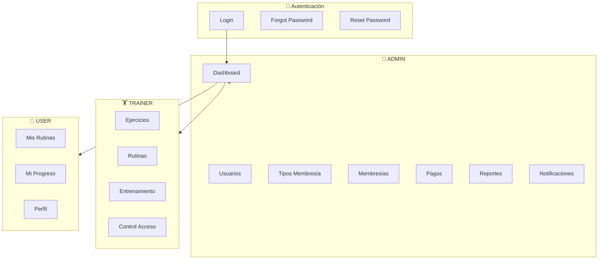
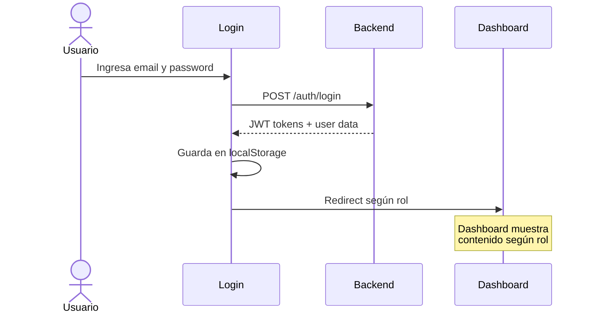
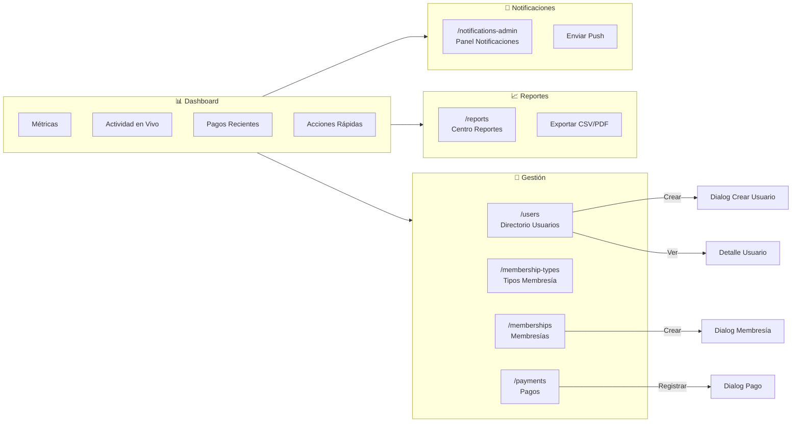
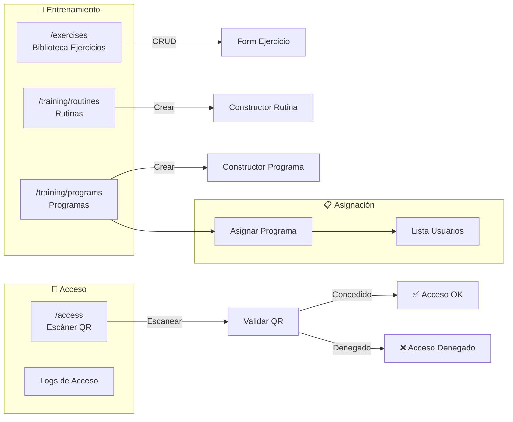
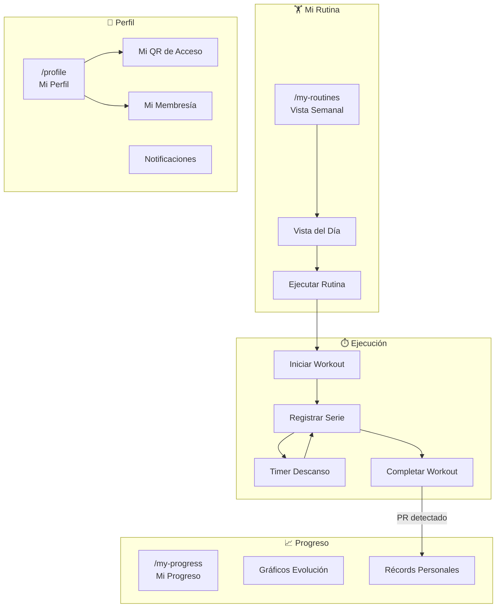
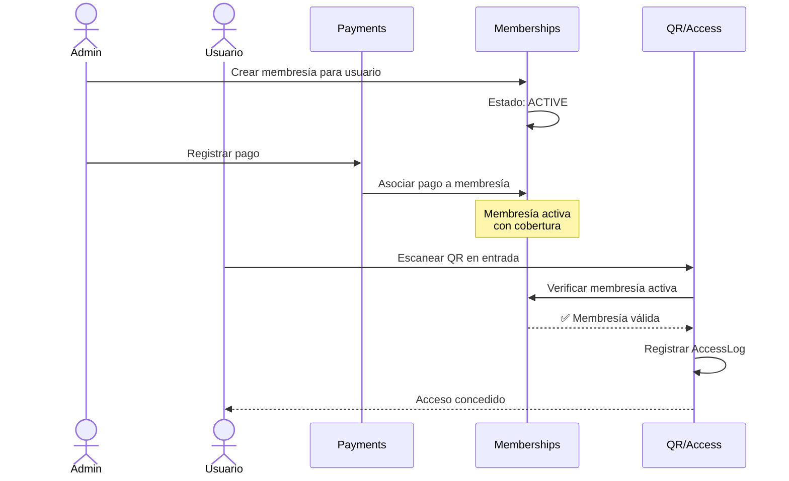
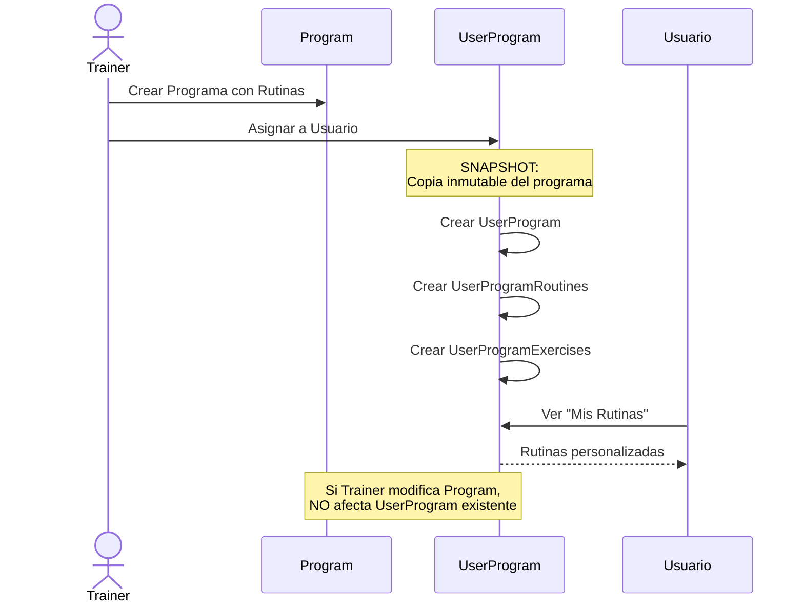
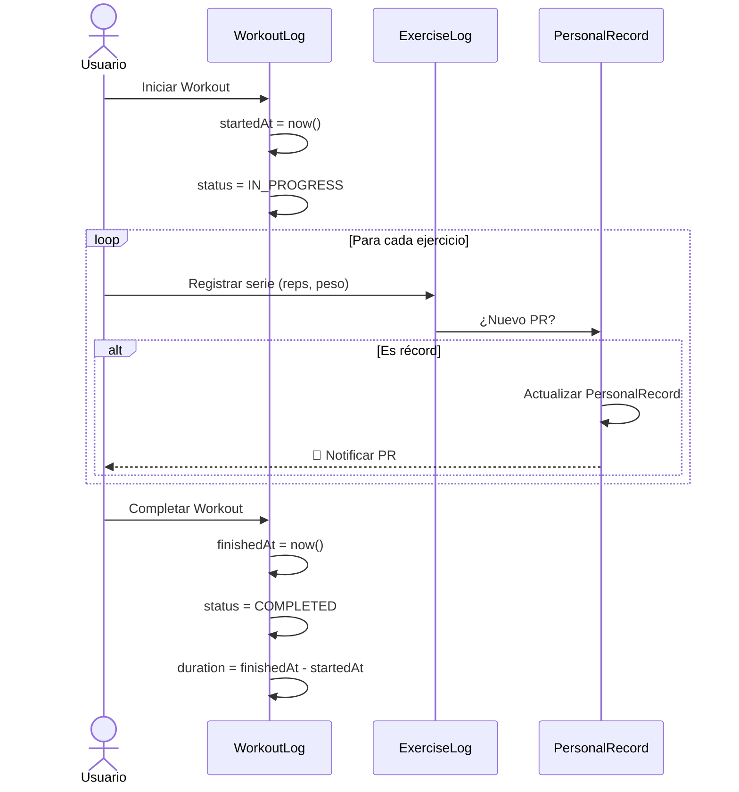
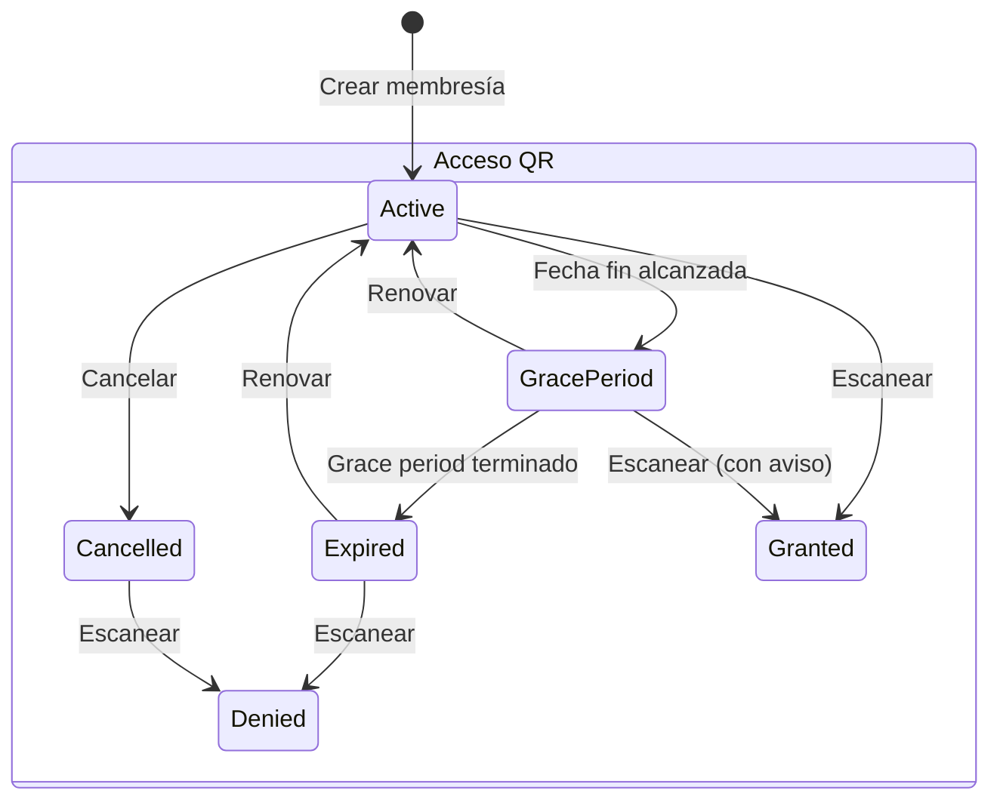

# FitFlow - Flujos de Usuario

Este documento describe los flujos de navegación y casos de uso principales por rol en la aplicación FitFlow.

> **Última actualización**: Febrero 2026

---

## Roles del Sistema

| Rol         | Descripción                | Acceso Principal                                                         |
| ----------- | -------------------------- | ------------------------------------------------------------------------ |
| **ADMIN**   | Administrador del gimnasio | Gestión completa: usuarios, membresías, pagos, reportes, notificaciones  |
| **TRAINER** | Entrenador                 | Ejercicios, rutinas, programas, asignación a usuarios, control de acceso |
| **USER**    | Socio/Cliente              | Mi rutina, entrenamientos, progreso, perfil, QR de acceso                |

---

## Mapa de Navegación General

---

## Flujo por Rol

### 🔐 Flujo de Autenticación (Todos los roles)

**Rutas:**

- `/login` - Inicio de sesión
- `/forgot-password` - Recuperar contraseña
- `/reset-password` - Establecer nueva contraseña

---

### 👔 Flujo ADMIN

**Permisos ADMIN:**
| Módulo | Acciones |
|--------|----------|
| Usuarios | CRUD completo |
| Tipos Membresía | CRUD completo |
| Membresías | CRUD completo |
| Pagos | CRUD completo |
| Reportes | Ver y exportar |
| Notificaciones | Enviar a todos/individual |

---

### 🏋️ Flujo TRAINER

**Permisos TRAINER:**
| Módulo | Acciones |
|--------|----------|
| Ejercicios | CRUD completo |
| Rutinas | CRUD completo |
| Programas | CRUD + Asignar |
| Usuarios | Solo lectura |
| Control Acceso | Escanear y ver logs |

---

### 👤 Flujo USER (Socio)

**Permisos USER:**
| Módulo | Acciones |
|--------|----------|
| Mis Rutinas | Ver programa asignado, ejecutar |
| Entrenamientos | Registrar series, pesos |
| Progreso | Ver PRs y evolución |
| Perfil | Ver/editar datos propios |
| Membresía | Solo lectura |
| QR | Ver código propio |

---

## Flujos Críticos de Negocio

### 1. Flujo Pago → Membresía → Acceso

### 2. Flujo Asignación de Programa (Patrón Snapshot)

### 3. Flujo Ejecución de Workout

---

## Navegación por Rutas

### Rutas Públicas (guestGuard)

| Ruta               | Componente              | Descripción          |
| ------------------ | ----------------------- | -------------------- |
| `/login`           | LoginComponent          | Inicio de sesión     |
| `/forgot-password` | ForgotPasswordComponent | Recuperar contraseña |
| `/reset-password`  | ResetPasswordComponent  | Nueva contraseña     |

### Rutas Protegidas (authGuard)

| Ruta           | Roles | Descripción         |
| -------------- | ----- | ------------------- |
| `/dashboard`   | Todos | Dashboard según rol |
| `/profile`     | Todos | Perfil del usuario  |
| `/my-routines` | Todos | Rutinas asignadas   |
| `/my-progress` | Todos | Progreso personal   |

### Rutas Admin (roleGuard: ADMIN)

| Ruta                   | Descripción             |
| ---------------------- | ----------------------- |
| `/users`               | Directorio de usuarios  |
| `/membership-types`    | Tipos de membresía      |
| `/memberships`         | Membresías              |
| `/payments`            | Pagos                   |
| `/reports`             | Centro de reportes      |
| `/notifications-admin` | Panel de notificaciones |

### Rutas Trainer (roleGuard: ADMIN, TRAINER)

| Ruta         | Descripción              |
| ------------ | ------------------------ |
| `/exercises` | Biblioteca de ejercicios |
| `/training`  | Gestión de entrenamiento |
| `/access`    | Control de acceso QR     |

---

## Estados de Membresía y Acceso

---

## Referencias

- [ARCHITECTURE.md](./ARCHITECTURE.md) - Arquitectura técnica
- [DATABASE_SCHEMA.md](./DATABASE_SCHEMA.md) - Diagrama de entidades
- [ENTITY_ANALYSIS.md](./ENTITY_ANALYSIS.md) - Decisiones arquitectónicas
