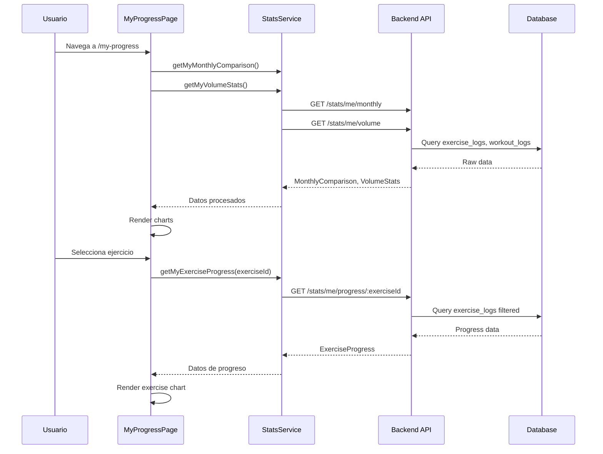

# Gráficos de Evolución de Progreso - Documentación Técnica

## Descripción General

El módulo de gráficos de evolución de progreso permite a los socios del gimnasio visualizar su progreso físico a lo largo del tiempo mediante gráficos interactivos. Utiliza Chart.js para la visualización y consume los endpoints del Stats Module del backend.

---

## Arquitectura

```
┌─────────────────────────────────────────────────────────────┐
│                        Frontend                              │
├─────────────────────────────────────────────────────────────┤
│  core/services/                                              │
│  └── stats.service.ts          ← Servicio para API calls    │
│                                                              │
│  core/models/                                                │
│  └── stats.model.ts            ← Interfaces TypeScript      │
│                                                              │
│  shared/charts/                                              │
│  ├── exercise-progress-chart/  ← Línea: peso/volumen        │
│  ├── volume-chart/             ← Barras: volumen diario     │
│  └── muscle-group-chart/       ← Doughnut: distribución     │
│                                                              │
│  features/progress/                                          │
│  ├── components/                                             │
│  │   ├── period-filter/        ← Filtro de período          │
│  │   ├── exercise-selector/    ← Selector de ejercicio      │
│  │   └── monthly-comparison-card/ ← Comparación mensual     │
│  └── pages/my-progress/        ← Página principal           │
└─────────────────────────────────────────────────────────────┘
                              │
                              ▼
┌─────────────────────────────────────────────────────────────┐
│                        Backend                               │
├─────────────────────────────────────────────────────────────┤
│  modules/stats/                                              │
│  ├── stats.controller.ts       ← Endpoints REST             │
│  ├── stats.service.ts          ← Lógica de negocio          │
│  └── dto/                      ← Data Transfer Objects      │
└─────────────────────────────────────────────────────────────┘
```

---

## API Endpoints

### Endpoints para Usuario Propio

| Método | Endpoint | Descripción |
|--------|----------|-------------|
| GET | `/stats/me/progress/:exerciseId` | Progreso de un ejercicio específico |
| GET | `/stats/me/volume` | Estadísticas de volumen total |
| GET | `/stats/me/monthly` | Comparación mes actual vs anterior |

### Endpoints para Admin/Trainer

| Método | Endpoint | Descripción |
|--------|----------|-------------|
| GET | `/stats/users/:userId/progress/:exerciseId` | Progreso de ejercicio de un usuario |
| GET | `/stats/users/:userId/volume` | Volumen de un usuario |
| GET | `/stats/users/:userId/monthly` | Comparación mensual de un usuario |

### Query Parameters

| Parámetro | Tipo | Descripción |
|-----------|------|-------------|
| `startDate` | string (ISO date) | Fecha de inicio del período |
| `endDate` | string (ISO date) | Fecha de fin del período |

---

## Modelos de Datos

### ExerciseProgress

```typescript
interface ExerciseProgress {
  exerciseId: string;
  exerciseName: string;
  dataPoints: ExerciseProgressPoint[];
  summary: ExerciseProgressSummary;
}

interface ExerciseProgressPoint {
  date: string;
  maxWeight: number;      // Peso máximo del día
  maxVolume: number;      // Volumen máximo (peso × reps)
  totalSets: number;      // Series completadas
  avgReps: number;        // Promedio de repeticiones
}

interface ExerciseProgressSummary {
  startWeight: number | null;
  currentWeight: number | null;
  weightChange: number;
  weightChangePercent: number;
  totalWorkouts: number;
  isStagnant: boolean;
  stagnantWeeks: number;
}
```

### VolumeStats

```typescript
interface VolumeStats {
  totalVolume: number;
  avgVolumePerWorkout: number;
  avgVolumePerDay: number;
  dataPoints: VolumeDataPoint[];
  byMuscleGroup: MuscleGroupVolume[];
}

interface VolumeDataPoint {
  date: string;
  volume: number;
  workoutCount: number;
}

interface MuscleGroupVolume {
  muscleGroupId: string | null;
  muscleGroupName: string;
  volume: number;
  percentage: number;
}
```

### MonthlyComparison

```typescript
interface MonthlyComparison {
  currentMonth: MonthStats;
  previousMonth: MonthStats;
  changes: MonthlyChanges;
}

interface MonthStats {
  totalWorkouts: number;
  totalVolume: number;
  totalSets: number;
  avgWorkoutDuration: number;
  personalRecords: number;
  uniqueExercises: number;
}

interface MonthlyChanges {
  workoutsChange: number;
  workoutsChangePercent: number;
  volumeChange: number;
  volumeChangePercent: number;
  setsChange: number;
  setsChangePercent: number;
}
```

---

## Componentes de Gráficos

### ExerciseProgressChartComponent

**Ubicación:** `shared/charts/exercise-progress-chart/`

**Propósito:** Muestra la evolución del peso máximo y volumen de un ejercicio específico a lo largo del tiempo.

**Inputs:**
- `dataPoints: ExerciseProgressPoint[]` - Datos de progreso
- `exerciseName: string` - Nombre del ejercicio (para título)
- `showVolume: boolean` - Mostrar eje secundario de volumen (default: true)

**Características:**
- Gráfico de línea dual (Chart.js)
- Eje Y izquierdo: Peso máximo (kg)
- Eje Y derecho: Volumen (kg×reps)
- Tooltips informativos
- Responsive

### VolumeChartComponent

**Ubicación:** `shared/charts/volume-chart/`

**Propósito:** Visualiza el volumen total de entrenamiento por fecha.

**Inputs:**
- `dataPoints: VolumeDataPoint[]` - Datos de volumen por fecha

**Características:**
- Gráfico de barras (Chart.js)
- Tooltips con volumen y cantidad de entrenamientos
- Formato numérico con separadores de miles

### MuscleGroupChartComponent

**Ubicación:** `shared/charts/muscle-group-chart/`

**Propósito:** Muestra la distribución del volumen por grupo muscular.

**Inputs:**
- `data: MuscleGroupVolume[]` - Datos de volumen por grupo

**Características:**
- Gráfico doughnut (Chart.js)
- Paleta de colores consistente
- Tooltips con volumen y porcentaje

---

## Flujo de Datos



---

## Consideraciones de Rendimiento

1. **Lazy Loading**: El módulo progress se carga lazy para no afectar el bundle inicial
2. **Chart.js Registerables**: Se registran solo una vez en cada componente
3. **Destrucción de Charts**: Los charts se destruyen en `ngOnDestroy` para evitar memory leaks
4. **Filtro de Período**: Por defecto 30 días para limitar datos iniciales

---

## Extensibilidad

### Agregar Nuevo Tipo de Gráfico

1. Crear componente en `shared/charts/[nombre]-chart/`
2. Seguir el patrón existente (ViewChild canvas, Chart.js)
3. Exportar en `shared/charts/index.ts`
4. Importar donde se necesite

### Agregar Vista de Entrenadores

El diseño permite reutilizar los componentes de `shared/charts/` en un nuevo tab del módulo Reports:

```typescript
// features/reports/components/client-progress-tab/
// Reutiliza: ExerciseProgressChartComponent, VolumeChartComponent, etc.
// Usa: statsService.getUserExerciseProgress(userId, exerciseId)
```

---

## Archivos Relacionados

| Archivo | Propósito |
|---------|-----------|
| `core/models/stats.model.ts` | Interfaces TypeScript |
| `core/services/stats.service.ts` | Servicio HTTP |
| `shared/charts/index.ts` | Exports de gráficos |
| `features/progress/progress.routes.ts` | Rutas del módulo |
| `app.routes.ts` | Ruta `/my-progress` |
