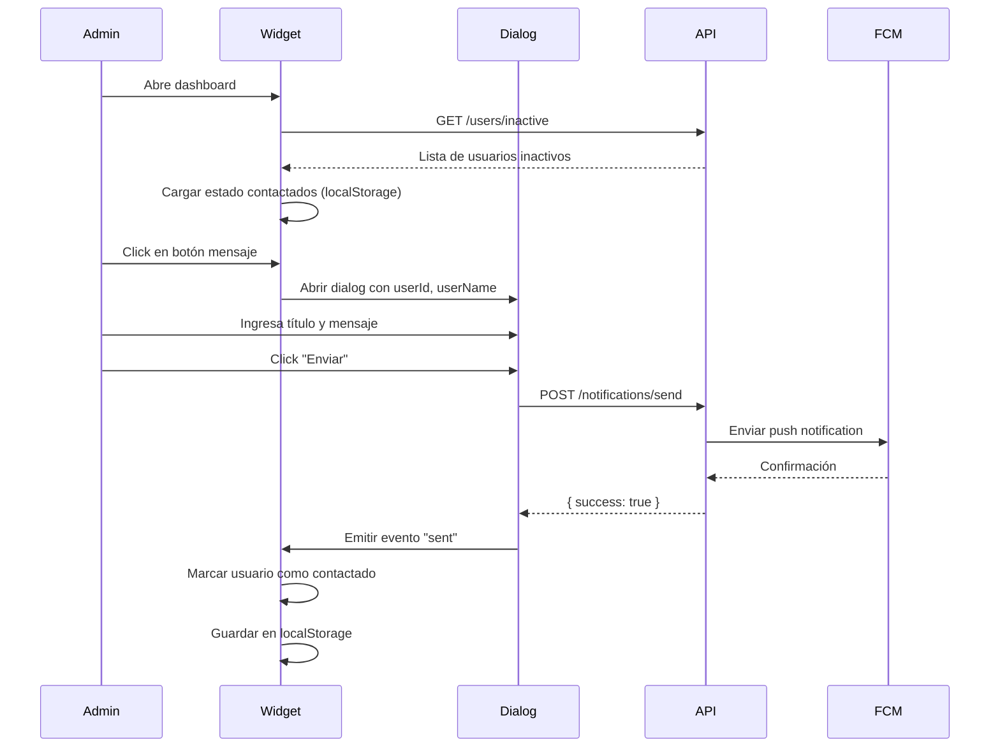

# Widget de Alerta de Retención - Documentación Técnica

## Descripción

Widget del dashboard que muestra usuarios inactivos (sin asistir por más de 7 días) y permite enviar notificaciones push directamente desde la interfaz.

## Arquitectura

### Componentes

```
frontend/src/app/features/dashboard/widgets/retention-alert/
├── retention-alert-widget.component.ts      # Componente principal
├── retention-alert-widget.component.html    # Template
├── retention-alert-widget.component.scss    # Estilos
└── retention-message-dialog/
    ├── retention-message-dialog.component.ts    # Dialog para enviar mensaje
    ├── retention-message-dialog.component.html  # Template del dialog
    └── retention-message-dialog.component.scss  # Estilos del dialog
```

### Backend

```
backend/src/modules/
├── attendance/
│   └── attendance.service.ts   # findInactiveUsersByDays()
├── users/
│   ├── users.controller.ts     # GET /users/inactive
│   ├── users.service.ts        # findInactiveUsers()
│   └── dto/
│       └── inactive-users.dto.ts  # DTOs para usuarios inactivos
└── notifications/
    └── notifications.controller.ts  # POST /notifications/send
```

## API Endpoints Utilizados

| Método | Endpoint                               | Propósito                           |
| ------ | -------------------------------------- | ----------------------------------- |
| GET    | `/users/inactive?daysSinceLastVisit=7` | Obtener lista de usuarios inactivos |
| POST   | `/notifications/send`                  | Enviar notificación push al usuario |

### Request: GET /users/inactive

```typescript
interface InactiveUsersQueryParams {
  daysSinceLastVisit?: number; // default: 7
}
```

### Response: GET /users/inactive

```typescript
interface InactiveUsersResponse {
  users: InactiveUser[];
  meta: {
    total: number;
    daysSinceLastVisitThreshold: number;
  };
}

interface InactiveUser {
  id: string;
  name: string;
  email: string;
  lastAttendanceDate: string | null;
  daysSinceLastVisit: number;
  membershipStatus: string | null;
}
```

### Request: POST /notifications/send

```typescript
interface SendNotificationDto {
  userId: string;
  title: string;
  body: string;
}
```

## Flujo de Datos



## Estado Local

El widget mantiene el estado de usuarios contactados en `localStorage` con una key mensual:

```typescript
// Key format: retention-contacted-MM-YYYY
const storageKey = `retention-contacted-${month}-${year}`;

// Stored value: array of user IDs
['uuid-1', 'uuid-2', 'uuid-3'];
```

Esto permite:

- Persistir el estado entre sesiones del navegador
- Reiniciar automáticamente cada mes
- No depender del backend para este estado

## Signals y Estado del Componente

```typescript
// Estado principal
readonly users = signal<InactiveUser[]>([]);
readonly dialogOpen = signal(false);
readonly selectedUser = signal<InactiveUser | null>(null);
readonly loading = signal(false);
readonly error = signal<string | null>(null);
readonly expanded = signal(false);
readonly contactedUserIds = signal<Set<string>>(new Set());

// Computed
readonly usersWithStatus = computed(() => /* users + contacted status */);
readonly pendingCount = computed(() => /* count of non-contacted */);
readonly totalCount = computed(() => /* total users */);
```

## Consideraciones de Performance

1. **Lazy loading**: El widget solo carga datos cuando está visible en el dashboard
2. **localStorage**: Estado de contactados es local, no requiere llamadas API extra
3. **Batch updates**: Los signals se actualizan de forma eficiente

## Notas de Desarrollo

### Decisiones Técnicas

1. **Dialog en lugar de navegación**: Se eligió un dialog inline para mejor UX, evitando salir de la página de dashboard
2. **Nuevo endpoint `/users/inactive`**: Se creó separado de `/users/low-attendance` para mantener compatibilidad con otros usos del endpoint original
3. **localStorage mensual**: El estado de "contactado" se reinicia cada mes para re-evaluar usuarios

### Futuras Mejoras

- Persistir estado de contactados en backend para sincronizar entre dispositivos
- Agregar campo de notas al contactar usuario
- Historial de mensajes enviados por usuario
